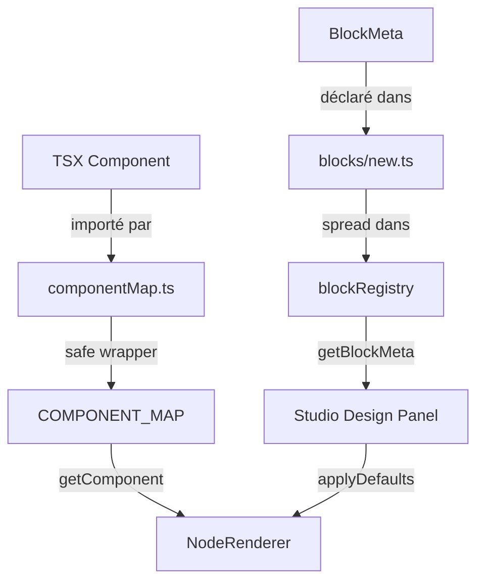

# Document de Design

## Vue d'ensemble

Cette feature complète l'intégration des composants `foundation` dans le Studio visuel en trois axes :

1. **Layouts manquants** : 8 layouts TSX existent dans `foundation/layout/ui/` mais sont absents du `COMPONENT_MAP`.
2. **Nouveaux blocs fonctionnels** : 23 blocs TSX existent dans `foundation/layout/ui/blocks/` mais ne sont ni dans le `COMPONENT_MAP`, ni dans le registre de métadonnées (`blocks/new.ts`), ni dans l'index des blocs.
3. **Cohérence registre/TSX** : Chaque bloc doit avoir ses props déclarées de façon cohérente entre le fichier TSX et le `BlockMeta`.

L'objectif est d'atteindre une couverture complète du catalogue `foundation` dans le Studio, sans modifier la logique interne des composants existants.

---

## Architecture

### Flux de données



### Couches concernées

```
foundation/layout/
├── registry/
│   ├── blocks.ts          ← getBlockMeta + blockRegistry (consolidé)
│   └── blocks/
│       ├── existing.ts    ← 11 blocs existants (inchangé)
│       └── new.ts         ← 23 nouveaux BlockMeta (à créer)
└── ui/
    ├── blocks/
    │   └── index.ts       ← 11 exports existants + 23 nouveaux
    ├── ParallaxLayout.tsx  ┐
    ├── SketchLayout.tsx    │
    ├── SwiperLayout.tsx    │ déjà créés,
    ├── Swipe2ScreenLayout  │ à enregistrer
    ├── SystemLayout.tsx    │ dans COMPONENT_MAP
    ├── TutoLayout.tsx      │
    ├── DeckLayout.tsx      │
    └── FlipLayout.tsx      ┘

studio/app/src/renderer/
└── componentMap.ts        ← imports + entrées COMPONENT_MAP à ajouter
```

---

## Composants et interfaces

### 1. `foundation/layout/registry/blocks/new.ts`

Nouveau fichier exportant `newBlocks: BlockMeta[]` avec les 23 `BlockMeta`.

```typescript
import type { BlockMeta } from "../../types";

export const newBlocks: BlockMeta[] = [
  // 23 entrées — voir section Data Models
];
```

### 2. `foundation/layout/registry/blocks.ts`

Modification pour importer et intégrer `newBlocks` :

```typescript
import { existingBlocks } from "./blocks/existing";
import { newBlocks } from "./blocks/new";

export const blockRegistry: BlockMeta[] = [...existingBlocks, ...newBlocks];

export function getBlockMeta(id: string): BlockMeta | undefined {
  return blockRegistry.find((m) => m.id === id);
}
```

### 3. `foundation/layout/ui/blocks/index.ts`

Ajout des 23 exports manquants après les 11 existants :

```typescript
// Blocs existants (inchangés)
export { default as AuthFormBlock } from "./AuthFormBlock";
// ... 10 autres

// Nouveaux blocs
export { default as SocialLinksBlock } from "./SocialLinksBlock";
export { default as ProductCardBlock } from "./ProductCardBlock";
// ... 21 autres
```

### 4. `studio/app/src/renderer/componentMap.ts`

Deux ajouts :

**Imports des 8 layouts manquants :**
```typescript
import ParallaxLayout from '../../../../foundation/layout/ui/ParallaxLayout';
import SketchLayout from '../../../../foundation/layout/ui/SketchLayout';
import SwiperLayout from '../../../../foundation/layout/ui/SwiperLayout';
import Swipe2ScreenLayout from '../../../../foundation/layout/ui/Swipe2ScreenLayout';
import SystemLayout from '../../../../foundation/layout/ui/SystemLayout';
import TutoLayout from '../../../../foundation/layout/ui/TutoLayout';
import DeckLayout from '../../../../foundation/layout/ui/DeckLayout';
import FlipLayout from '../../../../foundation/layout/ui/FlipLayout';
```

**Imports des 23 nouveaux blocs :**
```typescript
import SocialLinksBlock from '../../../../foundation/layout/ui/blocks/SocialLinksBlock';
// ... 22 autres
```

**Entrées dans COMPONENT_MAP :**
```typescript
ParallaxLayout: safe(ParallaxLayout),
SketchLayout: safe(SketchLayout),
// ... 6 autres layouts

SocialLinksBlock: safe(SocialLinksBlock),
// ... 22 autres blocs
```

> **Décision de design** : `TutoLayout` exporte un composant nommé `TutoLayout` (export nommé, pas default). L'import doit utiliser `{ TutoLayout }` et `SystemLayout` exporte `SystemUIWrapper`. Ces deux cas nécessitent un alias à l'import.

---

## Modèles de données

### Type `BlockMeta` (existant, rappel)

```typescript
interface BlockMeta {
  id: string;
  label: string;
  description: string;
  category: string;
  tags: string[];
  themeMapping: Record<string, string>;
  components: string[];
  slots: { name: string; label: string; required: boolean; array?: boolean }[];
  props: PropMeta[];
}

interface PropMeta {
  name: string;
  label: string;
  type: "string" | "number" | "boolean" | "enum" | "color" | "spacing" | "radius" | "shadow";
  group: "content" | "style" | "layout" | "behavior";
  default?: any;
  options?: string[];       // pour type "enum"
  themeDefault?: string;    // pour type "color"
}
```

### Inventaire des 23 nouveaux `BlockMeta`

Chaque entrée est dérivée de l'interface TypeScript du composant TSX correspondant. Les callbacks (`onPress`, `onChange`, etc.) sont exclus des `props`.

| ID | Catégorie | Props clés (non-callback) |
|----|-----------|--------------------------|
| `SocialLinksBlock` | social | links, direction, size, variant, spacing, color, background, borderRadius, showLabels |
| `ProductCardBlock` | ecommerce | name, price, originalPrice, imageUrl, rating, reviewCount, badge, inStock, background, borderRadius, padding, shadow |
| `NotificationItemBlock` | feedback | title, body, timestamp, read, iconName, iconColor, background, padding, showDivider, pressable |
| `PricingCardBlock` | ecommerce | planName, price, period, description, features, ctaLabel, highlighted, background, accentColor, borderRadius, padding, spacing, shadow |
| `TransactionItemBlock` | finance | merchant, category, amount, date, type, status, iconName, iconColor, background, padding, showDivider |
| `OnboardingSlideBlock` | onboarding | title, description, totalSlides, currentSlide, ctaLabel, skipLabel, accentColor, background, padding |
| `ChatBubbleBlock` | messaging | message, timestamp, isSent, isRead, senderName, avatarUrl, showAvatar, accentColor, background, maxWidth |
| `CalendarEventBlock` | calendar | title, date, dayNumber, month, startTime, endTime, location, attendeeCount, color, background, borderRadius, padding |
| `FileItemBlock` | files | name, size, type, updatedAt, background, padding, showDivider, pressable |
| `ContactCardBlock` | profile | name, role, company, avatarUrl, initials, phone, email, website, background, accentColor, borderRadius, padding, showActions |
| `MapPinBlock` | location | address, city, country, latitude, longitude, label, background, accentColor, borderRadius, padding, showCoordinates, showOpenButton |
| `PasswordStrengthBlock` | form | value, label, placeholder, showRequirements, background, borderRadius |
| `MediaPickerBlock` | media | items, maxItems, label, columns, itemSize, background, accentColor |
| `BannerBlock` | feedback | type, title, message, actionLabel, dismissible, icon, borderRadius, padding |
| `CommentBlock` | social | author, avatarUrl, initials, content, timestamp, likeCount, liked, replyCount, background, padding, showDivider |
| `OTPInputBlock` | form | length, label, error, disabled, size, accentColor, background |
| `TagInputBlock` | form | tags, placeholder, label, maxTags, background, tagColor, borderRadius |
| `StepperBlock` | navigation | steps, currentStep, orientation, accentColor, completedColor, background, showLabels, showDescriptions, size |
| `RatingBlock` | feedback | value, maxStars, readonly, size, activeColor, inactiveColor, showValue, label |
| `QuoteBlock` | content | quote, author, role, avatarUrl, accentColor, background, borderRadius, padding, showQuoteIcon, variant |
| `TimelineBlock` | content | events, accentColor, lineColor, spacing, showConnector |
| `CounterBlock` | form | value, min, max, step, label, size, accentColor, background, disabled |
| `SegmentedControlBlock` | navigation | segments, value, background, activeBackground, activeColor, inactiveColor, size, fullWidth |

### Inventaire des 8 layouts manquants

| ID | Dépendances natives | Props principales |
|----|--------------------|--------------------|
| `ParallaxLayout` | react-native-reanimated | rows, spacing, alternateDirection |
| `SketchLayout` | aucune | (aucune prop) |
| `SwiperLayout` | reanimated, gesture-handler | children, enableSwipeUp, enableSwipeDown, maxWidth, background, borderRadius, showCardCount, swipeThreshold |
| `Swipe2ScreenLayout` | gesture-handler, expo-camera, expo-haptics | slides |
| `SystemLayout` | expo-status-bar, safe-area-context | children, rootBackgroundColor, statusBarContentStyle, edges |
| `TutoLayout` | reanimated, safe-area-context | steps, visible, overlayOpacity, overlayColor, showSkip, nextLabel, finishLabel |
| `DeckLayout` | reanimated, gesture-handler, expo-haptics | children, peekOffset, peekScale, cycle, peekCount |
| `FlipLayout` | reanimated, gesture-handler | children, backContent, maxWidth, background, borderRadius, flipPerspective, swipeThreshold |

> **Note** : `TutoLayout` et `SystemUIWrapper` (alias de `SystemLayout`) utilisent des exports nommés. L'import dans `componentMap.ts` doit utiliser la syntaxe `import { TutoLayout } from '...'` et `import { SystemUIWrapper as SystemLayout } from '...'`.

---

## Propriétés de correction

*Une propriété est une caractéristique ou un comportement qui doit être vrai pour toutes les exécutions valides d'un système — essentiellement, un énoncé formel de ce que le système doit faire. Les propriétés servent de pont entre les spécifications lisibles par l'humain et les garanties de correction vérifiables par machine.*

### Propriété 1 : Couverture complète du COMPONENT_MAP

*Pour tout* identifiant attendu dans la liste des 8 layouts manquants et des 23 nouveaux blocs, `COMPONENT_MAP[id]` doit être défini et non-null.

**Valide : Requirements 1.1, 4.1**

### Propriété 2 : Absence de valeurs nulles dans le COMPONENT_MAP

*Pour tout* identifiant `id` présent dans `COMPONENT_MAP`, `COMPONENT_MAP[id]` ne doit pas être `undefined` ni `null`.

**Valide : Requirements 7.5**

### Propriété 3 : Résilience au rendu (safe wrapper)

*Pour tout* composant enregistré dans `COMPONENT_MAP`, le rendre avec un objet de props vide `{}` ne doit pas propager d'exception à l'arbre parent — l'`ErrorBoundary` doit l'intercepter.

**Valide : Requirements 1.3, 4.3, 7.1, 7.3**

### Propriété 4 : Couverture complète du registre de blocs

*Pour tout* identifiant `id` dans `newBlocks`, `getBlockMeta(id)` doit retourner un `BlockMeta` non-undefined dont le champ `id` est égal à l'identifiant recherché.

**Valide : Requirements 2.6, 6.1, 6.4**

### Propriété 5 : Absence de doublons dans le registre

*Pour tout* registre `blockRegistry`, la liste des `id` ne doit contenir aucun doublon (taille du Set === taille du tableau).

**Valide : Requirements 6.3**

### Propriété 6 : Intégrité structurelle des BlockMeta

*Pour tout* `BlockMeta` dans `newBlocks`, les champs obligatoires `id`, `label`, `description`, `category`, `tags`, `themeMapping`, `components`, `slots`, `props` doivent être présents, non-null, et de type correct (string non-vide, tableaux non-null).

**Valide : Requirements 2.2**

### Propriété 7 : Typage correct des props visuelles et enum

*Pour tout* `BlockMeta` dans `newBlocks`, pour toute `PropMeta` dont le type est `"enum"`, le champ `options` doit être présent et contenir au moins une valeur. Pour toute `PropMeta` dont le type est `"color"`, le champ `themeDefault` ou `default` doit être présent.

**Valide : Requirements 2.4, 5.3, 5.5**

### Propriété 8 : Exclusion des callbacks des métadonnées

*Pour tout* `BlockMeta` dans `newBlocks`, aucune `PropMeta` ne doit avoir un `name` commençant par `"on"` (convention des callbacks React).

**Valide : Requirements 5.4**

### Propriété 9 : Robustesse d'applyDefaults

*Pour tout* `BlockMeta` dans `newBlocks`, l'appel `applyDefaults({}, meta, theme)` doit retourner un objet sans lever d'exception, et toutes les props ayant un champ `default` dans le `BlockMeta` doivent avoir une valeur non-undefined dans l'objet retourné.

**Valide : Requirements 5.6, 7.2**

---

## Gestion des erreurs

### Erreurs de rendu dans le Studio

Tous les composants sont enregistrés via `safe()`, qui encapsule chaque composant dans un `ErrorBoundary`. En cas d'exception lors du rendu :
- L'`ErrorBoundary` affiche `"Render error"` avec un style rouge discret.
- L'erreur n'est pas propagée à l'arbre parent.
- Le Studio reste fonctionnel pour les autres composants.

### Props manquantes

`applyDefaults` applique les valeurs par défaut du `BlockMeta` avant le rendu. Les composants doivent donc recevoir des props complètes même si le Studio ne fournit que des props partielles.

### Dépendances natives manquantes

Les layouts utilisant `react-native-reanimated`, `react-native-gesture-handler`, `expo-camera`, `expo-haptics` ou `expo-navigation-bar` peuvent échouer si ces dépendances ne sont pas installées dans l'environnement Studio. Le wrapper `safe()` intercepte ces erreurs sans crasher l'application.

### Exports nommés vs default

`TutoLayout` et `SystemUIWrapper` utilisent des exports nommés. Si l'import est incorrect, TypeScript lèvera une erreur à la compilation. Ces cas doivent être traités explicitement dans `componentMap.ts` :

```typescript
import { TutoLayout } from '../../../../foundation/layout/ui/TutoLayout';
import { SystemUIWrapper as SystemLayout } from '../../../../foundation/layout/ui/SystemLayout';
```

### ID inexistant dans getComponent

`getComponent` retourne `null` pour tout ID absent du `COMPONENT_MAP`. Le `NodeRenderer` doit gérer ce cas sans crasher.

---

## Stratégie de test

### Approche duale

Les tests sont organisés en deux catégories complémentaires :

- **Tests unitaires** : vérifient des exemples précis, des cas limites et des comportements d'erreur.
- **Tests de propriétés** : vérifient des propriétés universelles sur l'ensemble des données (property-based testing).

### Tests unitaires

Fichier cible : `studio/app/src/renderer/__tests__/componentMap.stubs.test.ts` (existant, à étendre)

**Exemples à couvrir :**
- `getComponent("IdInexistant")` retourne `null` (Requirement 4.5)
- `getBlockMeta("IdInexistant")` retourne `undefined` (Requirement 6.5)
- Le rendu d'un composant avec des props invalides affiche `"Render error"` (Requirement 7.4)
- Chaque nouveau layout est accessible via `getComponent` (smoke test)

### Tests de propriétés (PBT)

Bibliothèque recommandée : **`fast-check`** (compatible TypeScript/Jest, déjà courant dans l'écosystème React Native).

Configuration : minimum **100 itérations** par test de propriété.

**Tag format** : `// Feature: foundation-component-map-blocks, Property N: <texte>`

#### Propriété 1 — Couverture COMPONENT_MAP
```typescript
// Feature: foundation-component-map-blocks, Property 1: tous les IDs attendus sont dans COMPONENT_MAP
it('tous les IDs de layouts et blocs attendus sont dans COMPONENT_MAP', () => {
  const expectedIds = [
    'ParallaxLayout', 'SketchLayout', 'SwiperLayout', 'Swipe2ScreenLayout',
    'SystemLayout', 'TutoLayout', 'DeckLayout', 'FlipLayout',
    'SocialLinksBlock', 'ProductCardBlock', /* ... 21 autres */
  ];
  fc.assert(fc.property(fc.constantFrom(...expectedIds), (id) => {
    expect(COMPONENT_MAP[id]).toBeDefined();
    expect(COMPONENT_MAP[id]).not.toBeNull();
  }));
});
```

#### Propriété 2 — Absence de valeurs nulles
```typescript
// Feature: foundation-component-map-blocks, Property 2: aucune valeur null dans COMPONENT_MAP
it('aucune entrée du COMPONENT_MAP ne vaut undefined ou null', () => {
  fc.assert(fc.property(fc.constantFrom(...Object.keys(COMPONENT_MAP)), (id) => {
    expect(COMPONENT_MAP[id]).toBeDefined();
    expect(COMPONENT_MAP[id]).not.toBeNull();
  }));
});
```

#### Propriété 3 — Résilience au rendu
```typescript
// Feature: foundation-component-map-blocks, Property 3: rendu avec props vides ne propage pas d'exception
it('tout composant du COMPONENT_MAP peut être rendu avec des props vides sans crash', () => {
  fc.assert(fc.property(fc.constantFrom(...Object.keys(COMPONENT_MAP)), (id) => {
    const Comp = COMPONENT_MAP[id];
    expect(() => render(React.createElement(Comp, {}))).not.toThrow();
  }), { numRuns: 100 });
});
```

#### Propriété 4 — Couverture du registre de blocs
```typescript
// Feature: foundation-component-map-blocks, Property 4: getBlockMeta couvre tous les nouveaux blocs
it('getBlockMeta retourne le bon BlockMeta pour chaque id de newBlocks', () => {
  fc.assert(fc.property(fc.constantFrom(...newBlocks.map(b => b.id)), (id) => {
    const meta = getBlockMeta(id);
    expect(meta).toBeDefined();
    expect(meta!.id).toBe(id);
  }));
});
```

#### Propriété 5 — Absence de doublons
```typescript
// Feature: foundation-component-map-blocks, Property 5: pas de doublon d'id dans blockRegistry
it('blockRegistry ne contient aucun doublon d\'id', () => {
  const ids = blockRegistry.map(b => b.id);
  expect(new Set(ids).size).toBe(ids.length);
});
```

#### Propriété 6 — Intégrité structurelle des BlockMeta
```typescript
// Feature: foundation-component-map-blocks, Property 6: tous les BlockMeta de newBlocks ont les champs obligatoires
it('chaque BlockMeta de newBlocks a les champs obligatoires non-vides', () => {
  fc.assert(fc.property(fc.constantFrom(...newBlocks), (meta) => {
    expect(typeof meta.id).toBe('string');
    expect(meta.id.length).toBeGreaterThan(0);
    expect(typeof meta.label).toBe('string');
    expect(typeof meta.description).toBe('string');
    expect(typeof meta.category).toBe('string');
    expect(Array.isArray(meta.tags)).toBe(true);
    expect(Array.isArray(meta.props)).toBe(true);
    expect(Array.isArray(meta.slots)).toBe(true);
  }));
});
```

#### Propriété 7 — Typage des props visuelles et enum
```typescript
// Feature: foundation-component-map-blocks, Property 7: props enum ont des options, props color ont un themeDefault ou default
it('les props enum ont des options et les props color ont un themeDefault ou default', () => {
  fc.assert(fc.property(fc.constantFrom(...newBlocks), (meta) => {
    for (const prop of meta.props) {
      if (prop.type === 'enum') {
        expect(Array.isArray(prop.options)).toBe(true);
        expect(prop.options!.length).toBeGreaterThan(0);
      }
      if (prop.type === 'color') {
        expect(prop.themeDefault !== undefined || prop.default !== undefined).toBe(true);
      }
    }
  }));
});
```

#### Propriété 8 — Exclusion des callbacks
```typescript
// Feature: foundation-component-map-blocks, Property 8: aucune prop callback dans les BlockMeta
it('aucune PropMeta de newBlocks ne commence par "on"', () => {
  fc.assert(fc.property(fc.constantFrom(...newBlocks), (meta) => {
    for (const prop of meta.props) {
      expect(prop.name.startsWith('on')).toBe(false);
    }
  }));
});
```

#### Propriété 9 — Robustesse d'applyDefaults
```typescript
// Feature: foundation-component-map-blocks, Property 9: applyDefaults ne lève pas d'exception sur props vides
it('applyDefaults({}, meta, theme) ne lève pas d\'exception pour tout BlockMeta de newBlocks', () => {
  fc.assert(fc.property(fc.constantFrom(...newBlocks), (meta) => {
    expect(() => applyDefaults({}, meta, mockTheme)).not.toThrow();
    const result = applyDefaults({}, meta, mockTheme);
    for (const prop of meta.props) {
      if (prop.default !== undefined) {
        expect(result[prop.name]).not.toBeUndefined();
      }
    }
  }));
});
```

### Équilibre tests unitaires / propriétés

Les tests de propriétés couvrent les règles universelles sur l'ensemble des données. Les tests unitaires se concentrent sur :
- Les cas limites (ID inexistant, props null)
- Les comportements d'erreur précis (ErrorBoundary, getComponent null)
- Les smoke tests d'intégration (chaque nouveau composant est rendu une fois)

Éviter de dupliquer la logique : si une propriété couvre déjà un cas, ne pas écrire un test unitaire redondant.
