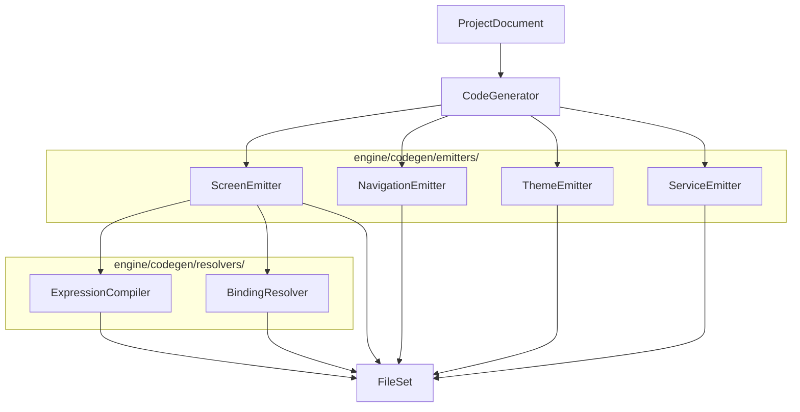

# Document de Conception — Génération de Code (studio-codegen)

## Vue d'ensemble

Le système de génération de code de Flipova Studio transforme un `ProjectDocument` en un
projet Expo/React Native complet et immédiatement exécutable. Le pipeline suit un modèle
de transformation en plusieurs étapes : le `ProjectDocument` est analysé par un ensemble
d'émetteurs spécialisés qui produisent chacun un sous-ensemble de fichiers, puis le
`CodeGenerator` orchestre l'ensemble et retourne un `FileSet`.

### Objectifs de conception

- **Fidélité** : le code généré doit se comporter exactement comme la prévisualisation du studio.
- **Lisibilité** : le code généré doit être lisible et maintenable par un développeur humain.
- **Extensibilité** : chaque émetteur est indépendant et peut être remplacé ou étendu.
- **Testabilité** : chaque module est une fonction pure, testable en isolation.

---

## Architecture

### Diagramme de pipeline



### Localisation des modules

Tous les modules de génération de code résident dans `engine/codegen/` :

```
engine/codegen/
├── index.ts                    # Point d'entrée public
├── generator.ts                # ScreenEmitter (existant, a refactoriser)
├── naming.ts                   # Utilitaires de nommage (existant)
├── project.ts                  # CodeGenerator orchestrateur (existant, a etendre)
├── resolvers/
│   ├── expression.ts           # ExpressionCompiler (nouveau)
│   └── binding.ts              # BindingResolver (nouveau)
└── emitters/
    ├── screen.ts               # ScreenEmitter refactorise (nouveau)
    ├── navigation.ts           # NavigationEmitter (nouveau)
    ├── theme.ts                # ThemeEmitter (nouveau)
    └── service.ts              # ServiceEmitter (nouveau)
```

---

## Composants et interfaces

### CodeGenerator (orchestrateur)

Point d'entree principal. Recoit un `ProjectDocument`, delegue a chaque emetteur,
et retourne la liste complete des fichiers generes.

```typescript
// engine/codegen/index.ts
export function generateProject(project: ProjectDocument): GeneratedFile[];

export interface GeneratedFile {
  path: string;
  content: string;
}
```

### ExpressionCompiler

Fonction pure qui compile une expression studio en code TypeScript valide.
Delegue a `resolveForCodegen` de `engine/tree/expressions.ts`.

```typescript
// engine/codegen/resolvers/expression.ts

export interface CompileContext {
  /** Nom de la variable d'item dans un contexte de repetition, ex. "user" */
  itemVar?: string;
  /** Variables d'etat de la page courante */
  stateKeys?: Map<string, { type: string; default: string }>;
}

/**
 * Compile une expression studio en code TypeScript valide.
 * Fonction pure — aucun effet de bord.
 *
 * @param expr  Expression studio, ex. "$state.email", "$global.theme", "item.name"
 * @param ctx   Contexte de compilation
 * @returns     Code TypeScript valide, ex. "email", "globalState.theme", "user.name"
 */
export function compile(expr: string, ctx: CompileContext): string;
```

**Table de resolution des expressions :**

| Expression             | Code TypeScript genere          |
|------------------------|---------------------------------|
| `$state.x`             | `x`                             |
| `$state.x.y`           | `x.y`                           |
| `$global.x`            | `globalState.x`                 |
| `$query.xData`         | `xData`                         |
| `$const.KEY`           | `CONSTANTS.KEY`                 |
| `$env.KEY`             | `process.env.KEY`               |
| `$theme.primary`       | `theme.primary`                 |
| `$node.id.prop`        | `prop` (si prop dans stateKeys) |
| `item.field`           | `item.field`                    |
| `fieldName` (repeat)   | `{itemVar}.fieldName`           |
| `$state.x > 0`         | `x > 0`                         |
| `$state.a && $state.b` | `a && b`                        |

**Tokenizer regex :**

```typescript
const TOKEN_PATTERNS = [
  /^\$state\.([a-zA-Z_][a-zA-Z0-9_.[\]]*)/,
  /^\$global\.([a-zA-Z_][a-zA-Z0-9_.]*)/,
  /^\$query\.([a-zA-Z_][a-zA-Z0-9_.[\]]*)/,
  /^\$const\.([A-Z_][A-Z0-9_]*)/,
  /^\$env\.([A-Z_][A-Z0-9_]*)/,
  /^\$theme\.([a-zA-Z_][a-zA-Z0-9_.]*)/,
  /^\$node\.([a-zA-Z0-9_]+)\.([a-zA-Z_][a-zA-Z0-9_.]*)/,
  /^item\.([a-zA-Z_][a-zA-Z0-9_.]*)/,
  /^([a-zA-Z_][a-zA-Z0-9_]*)/, // bare field (repeat context)
];
```

### BindingResolver

Mappe chaque entree `bindings` d'un `TreeNode` vers un getter JSX et, si applicable,
un setter JSX.

```typescript
// engine/codegen/resolvers/binding.ts

export interface ResolvedBinding {
  /** Prop JSX getter, ex. `value={email}` */
  getter: string;
  /** Prop JSX setter, ex. `onChangeText={(v) => setEmail(v)}` */
  setter?: string;
}

/**
 * Resout une entree de binding en getter + setter optionnel.
 *
 * @param prop    Nom de la prop, ex. "value", "checked", "data"
 * @param expr    Expression studio, ex. "$state.email"
 * @param ctx     Contexte de compilation
 * @returns       Getter et setter resolus
 */
export function resolveBinding(
  prop: string,
  expr: string,
  ctx: CompileContext
): ResolvedBinding;
```

**Table d'inference des setters :**

| Prop source      | Prop setter generee  | Signature du setter                          |
|------------------|----------------------|----------------------------------------------|
| `value`          | `onChangeText`       | `(v) => setState(prev => ({...prev, x: v}))` |
| `text`           | `onChangeText`       | `(v) => setState(prev => ({...prev, x: v}))` |
| `checked`        | `onValueChange`      | `(v) => setX(v)`                             |
| `selectedValue`  | `onValueChange`      | `(v) => setX(v)`                             |
| `value` (Switch) | `onValueChange`      | `(v) => setX(v)`                             |
| `data`           | *(aucun)*            | lecture seule                                |
| `source`         | *(aucun)*            | lecture seule                                |

**Patterns de code concrets :**

```typescript
// Getter simple
value={state.email}

// Liaison bidirectionnelle (TextInput)
value={email}
onChangeText={(v) => setEmail(v)}

// Donnees de requete
data={getUsers.data ?? []}

// Champ d'item dans un repeat
text={item.firstName}

// Etat global
value={globalState.userName}
onChangeText={(v) => setGlobalUserName(v)}
```

### ScreenEmitter

Genere les deux fichiers d'un ecran : `{Screen}.tsx` et `{Screen}.hook.ts`.

```typescript
// engine/codegen/emitters/screen.ts

export interface EmitContext {
  stateKeys: Map<string, { type: string; default: string }>;
  itemVar?: string;
  indent: number;
  imports: ImportCollector;
  queries?: DataQuery[];
}

/**
 * Genere le JSX d'un noeud de maniere recursive.
 * Gere : repeat (.map()), conditionnel (&&), animation (Animated.View).
 */
export function emitNode(node: TreeNode, ctx: EmitContext): string;

/** Genere le fichier .tsx d'un ecran. */
export function emitScreen(page: PageDocument, queries?: DataQuery[]): string;

/** Genere le fichier .hook.ts d'un ecran. */
export function emitHook(page: PageDocument, queries?: DataQuery[], hookDir?: string): string;
```

**Ordre de traitement dans `emitNode` :**

1. Si `node.repeatBinding` → envelopper dans `.map((item, index) => (...))`
2. Si `node.conditionalRender` → envelopper dans `{expr && (...)}` ou `{!expr && (...)}`
3. Si `node.animation` → envelopper dans `<Animated.View style={animStyle}>`
4. Emettre le composant avec ses props statiques + bindings resolus
5. Recurser sur les enfants

### NavigationEmitter

Genere les fichiers `_layout.tsx` Expo Router a partir des `ScreenGroup`.

```typescript
// engine/codegen/emitters/navigation.ts

export function emitNavigation(project: ProjectDocument): GeneratedFile[];
export function emitRootLayout(project: ProjectDocument): string;
export function emitGroupLayout(group: ScreenGroup, project: ProjectDocument): string;
```

**Mapping ScreenGroup → structure Expo Router :**

| Type de groupe | Dossier genere          | Composant de layout              |
|----------------|-------------------------|----------------------------------|
| `tabs`         | `app/(groupName)/`      | `<Tabs>`                         |
| `stack`        | `app/(groupName)/`      | `<Stack>`                        |
| `drawer`       | `app/(groupName)/`      | `<Drawer>`                       |
| `auth`         | `app/(auth)/`           | `<Stack>` simple                 |
| `protected`    | `app/(protected)/`      | `<Stack>` + `<Redirect>` si non auth |

### ThemeEmitter

```typescript
// engine/codegen/emitters/theme.ts

export function emitThemeTokens(project: ProjectDocument): string;
export function emitThemeIndex(project: ProjectDocument): string;
```

### ServiceEmitter

```typescript
// engine/codegen/emitters/service.ts

export function emitService(service: ServiceConfig): string;
export function emitController(query: DataQuery, project: ProjectDocument): string;
export function emitControllersIndex(queries: DataQuery[]): string;
```

---

## Modeles de donnees

### Structure des fichiers generes par ecran

Pour chaque `PageDocument`, deux fichiers sont generes :

**`{Screen}.hook.ts`** — toute la logique d'etat et les handlers :

```typescript
// Exemple : HomeScreen.hook.ts
import { useState, useCallback } from "react";
import { useRouter } from "expo-router";
import { useGetUsers } from "../controllers/getUsers.controller";

export function useHomeScreen() {
  const [email, setEmail] = useState<string>("");
  const [isLoading, setIsLoading] = useState<boolean>(false);

  const { data: users, loading: usersLoading, refetch: refetchGetUsers } = useGetUsers();

  const router = useRouter();

  const handleButtonPress = useCallback(async () => {
    router.push("/home");
  }, [router]);

  const handleTextInputChangeText = useCallback(async () => {
    setEmail(email);
  }, [email]);

  return {
    email, setEmail,
    isLoading, setIsLoading,
    users, usersLoading, refetchGetUsers,
    handleButtonPress,
    handleTextInputChangeText,
  };
}
```

**`{Screen}.tsx`** — imports, JSX, StyleSheet :

```typescript
// Exemple : HomeScreen.tsx
import React from "react";
import { StyleSheet } from "react-native";
import { Stack, TextInput, Button } from "@flipova/foundation";
import { useHomeScreen } from "./HomeScreen.hook";

export default function HomeScreen() {
  const { email, setEmail, handleButtonPress } = useHomeScreen();

  return (
    <Stack>
      <TextInput
        value={email}
        onChangeText={(v) => setEmail(v)}
        placeholder="Email"
      />
      <Button label="Se connecter" onPress={handleButtonPress} />
    </Stack>
  );
}

const styles = StyleSheet.create({});
```

### Structure de navigation generee

```
app/
├── _layout.tsx                 # RootLayout (FoundationProvider + SafeAreaProvider)
├── (auth)/
│   ├── _layout.tsx             # Stack simple sans header
│   ├── LoginScreen.tsx
│   └── LoginScreen.hook.ts
├── (tabs)/
│   ├── _layout.tsx             # Tabs avec icones
│   ├── HomeScreen.tsx
│   ├── HomeScreen.hook.ts
│   ├── ProfileScreen.tsx
│   └── ProfileScreen.hook.ts
└── (protected)/
    ├── _layout.tsx             # Stack + Redirect si non authentifie
    ├── DashboardScreen.tsx
    └── DashboardScreen.hook.ts
```

### Modele de donnees interne du pipeline

```typescript
interface ImportCollector {
  imports: Map<string, Set<string>>;
}

interface HandlerCollector {
  handlers: Map<string, string[]>; // handlerName -> lignes de code
}

interface AnimationCollector {
  animations: Map<string, AnimationConfig>; // nodeId -> config
}
```

---

## Proprietes de correction

*Une propriete est une caracteristique ou un comportement qui doit etre vrai pour toutes les
executions valides d'un systeme — essentiellement, un enonce formel de ce que le systeme doit
faire. Les proprietes servent de pont entre les specifications lisibles par l'humain et les
garanties de correction verifiables par machine.*

### Propriete 1 : Generation complete des fichiers d'ecran

*Pour tout* `ProjectDocument` contenant N pages, le `CodeGenerator` doit produire exactement
N fichiers `.tsx` et N fichiers `.hook.ts`, un par page.

**Valide : Exigences 1.1, 1.7**

### Propriete 2 : Fidelite de l'arbre JSX

*Pour tout* `TreeNode` avec des enfants, le JSX genere par `emitNode` doit contenir
autant de niveaux d'imbrication que la profondeur de l'arbre, et chaque noeud doit
apparaitre exactement une fois dans le JSX genere.

**Valide : Exigences 1.2, 14.1**

### Propriete 3 : Mapping registryId vers composant

*Pour tout* `TreeNode` dont le `registryId` est connu dans `COMPONENT_MAP`, le JSX
genere doit contenir ce `registryId` comme tag JSX. Pour tout `registryId` inconnu,
le JSX genere doit contenir un `<View>` de substitution avec un commentaire.

**Valide : Exigences 1.3, 1.4**

### Propriete 4 : Round-trip ExpressionCompiler

*Pour toute* expression studio valide (commencant par `$state.`, `$global.`, `$query.`,
`$const.`, `item.`), `compile(expr, ctx)` doit retourner une chaine TypeScript non vide
qui, evaluee dans le contexte genere, produit la meme valeur que `resolveForPreview(expr, ctx)`
dans la previsualisation.

**Valide : Exigences 3.1, 3.2, 3.3, 3.4, 3.5, 14.2**

### Propriete 5 : Robustesse de l'ExpressionCompiler

*Pour toute* chaine arbitraire passee a `compile()`, la fonction ne doit jamais lever
d'exception — elle doit toujours retourner une chaine (soit le code compile, soit
l'expression originale avec un commentaire d'avertissement).

**Valide : Exigences 3.7**

### Propriete 6 : Idempotence de l'ExpressionCompiler

*Pour toute* expression studio valide `expr`, appeler `compile(compile(expr, ctx), ctx)`
doit retourner le meme resultat que `compile(expr, ctx)` — compiler deux fois ne doit
pas modifier le resultat.

**Valide : Exigences 3.1–3.6**

### Propriete 7 : Generation correcte des useState

*Pour tout* `PageDocument` avec un tableau `state` de N entrees, le hook genere doit
contenir exactement N appels `useState`, chacun avec le type TypeScript et la valeur
initiale correspondant aux champs `type` et `default` de la `PageState`.

**Valide : Exigences 4.1, 4.2, 4.3**

### Propriete 8 : Generation des handlers d'evenements

*Pour tout* `TreeNode` avec un champ `events` contenant M evenements non vides, le hook
genere doit contenir M fonctions handler, et le JSX genere doit passer chaque handler
comme prop au composant correspondant.

**Valide : Exigences 5.1, 5.2**

### Propriete 9 : Round-trip des actions

*Pour tout* type d'action connu (`navigate`, `setState`, `callApi`, `alert`, `toast`,
`openURL`), le code genere par `renderAction(action)` doit contenir le pattern TypeScript
attendu (respectivement : `router.push()`, `setX()`, `await refetchX()`, `Alert.alert()`,
commentaire toast, `Linking.openURL()`).

**Valide : Exigences 5.3–5.10**

### Propriete 10 : Generation correcte du repeat

*Pour tout* `TreeNode` avec un `repeatBinding`, le JSX genere doit contenir un appel
`.map((item, index) => (...))` sur la source resolue, avec une prop `key` utilisant
`repeatBinding.keyProp`, et les enfants du noeud doivent avoir acces a la variable `item`.

**Valide : Exigences 6.1–6.4, 14.3**

### Propriete 11 : Generation correcte du rendu conditionnel

*Pour tout* `TreeNode` avec un `conditionalRender`, le JSX genere doit contenir
`{expr && (...)}` pour `mode: "show"` et `{!expr && (...)}` pour `mode: "hide"`,
ou `expr` est l'expression compilee par l'`ExpressionCompiler`.

**Valide : Exigences 7.1–7.3, 14.4**

### Propriete 12 : Generation complete des services et controleurs

*Pour tout* `ProjectDocument` avec S services et Q requetes, le `ServiceEmitter` doit
produire exactement S fichiers `services/*.ts` et Q fichiers `controllers/*.controller.ts`.

**Valide : Exigences 10.1–10.4**

### Propriete 13 : Round-trip BindingResolver

*Pour tout* binding `{prop: expr}` ou `expr` est une expression `$state.x`, le getter
genere doit contenir `x` et, si `prop` est une prop de saisie connue, le setter genere
doit contenir `setX`.

**Valide : Exigences 2.1–2.6**

---

## Gestion des erreurs

### Strategie de degradation gracieuse

Le generateur ne doit jamais lever d'exception non geree. Pour chaque cas d'erreur,
une strategie de fallback est definie :

| Situation d'erreur                        | Comportement attendu                                        |
|-------------------------------------------|-------------------------------------------------------------|
| `registryId` inconnu                      | Emettre `<View>{/* unknown: {registryId} */}</View>`        |
| Expression de binding invalide            | Emettre `{/* binding non resolu: {expr} */}`                |
| Expression conditionnelle vide            | Rendre le noeud sans condition + commentaire d'avertissement |
| Source de repeat non tableau              | Emettre fragment vide + commentaire d'avertissement         |
| `$node.id.prop` non resolu                | Emettre `{/* $node non resolu: {expr} */}`                  |
| Service introuvable pour une requete      | Emettre un controleur avec un commentaire TODO              |
| Expression inconnue                       | Emettre l'expression telle quelle entre accolades JSX       |

### Validation des imports

Avant de retourner le `FileSet`, le `CodeGenerator` doit verifier que :
- Tous les imports generes dans les fichiers `.tsx` et `.ts` referencent des modules existants.
- Les imports de `@flipova/foundation` ne contiennent que des composants presents dans `COMPONENT_MAP`.
- Les imports de controleurs correspondent a des fichiers effectivement generes.

---

## Strategie de test

### Approche duale

Les tests sont organises en deux categories complementaires :

**Tests unitaires** — exemples specifiques, cas limites, conditions d'erreur :
- Verifier qu'un `ProjectDocument` minimal genere un projet valide
- Verifier le fallback pour un `registryId` inconnu
- Verifier la generation d'un ecran sans etat ni evenements
- Verifier la generation d'un layout de navigation `tabs` avec 3 ecrans

**Tests de proprietes** — proprietes universelles sur des entrees generees aleatoirement :
- Utiliser **fast-check** (TypeScript) comme bibliotheque de property-based testing
- Minimum 100 iterations par test de propriete
- Chaque test de propriete doit referencer la propriete de conception correspondante

### Configuration des tests de proprietes

```typescript
// Exemple de test de propriete avec fast-check
import * as fc from "fast-check";
import { compile } from "../resolvers/expression";

// Feature: studio-codegen, Property 5: Robustesse de l'ExpressionCompiler
test("compile() ne leve jamais d'exception sur une entree arbitraire", () => {
  fc.assert(
    fc.property(fc.string(), fc.record({ itemVar: fc.option(fc.string()) }), (expr, ctx) => {
      expect(() => compile(expr, ctx)).not.toThrow();
      expect(typeof compile(expr, ctx)).toBe("string");
    }),
    { numRuns: 100 }
  );
});
```

### Arbitraires fast-check pour les types du domaine

```typescript
const arbPageState = fc.record({
  name: fc.string({ minLength: 1 }),
  type: fc.constantFrom("string", "number", "boolean", "object", "array"),
  default: fc.oneof(fc.string(), fc.integer(), fc.boolean()),
  scope: fc.constantFrom("page", "app"),
});

const arbTreeNode = fc.letrec(tie => ({
  node: fc.record({
    id: fc.string({ minLength: 1 }),
    kind: fc.constantFrom("layout", "component", "block", "primitive"),
    registryId: fc.constantFrom("Stack", "Button", "TextInput", "Text", "Box"),
    props: fc.dictionary(fc.string(), fc.string()),
    children: fc.array(tie("node") as fc.Arbitrary<TreeNode>, { maxLength: 3 }),
  }),
})).node as fc.Arbitrary<TreeNode>;
```

### Mapping proprietes vers tests

| Propriete | Tag de test                                                               | Type |
|-----------|---------------------------------------------------------------------------|------|
| P1        | `Feature: studio-codegen, Property 1: Generation complete fichiers`       | PBT  |
| P2        | `Feature: studio-codegen, Property 2: Fidelite arbre JSX`                 | PBT  |
| P3        | `Feature: studio-codegen, Property 3: Mapping registryId`                 | PBT  |
| P4        | `Feature: studio-codegen, Property 4: Round-trip ExpressionCompiler`      | PBT  |
| P5        | `Feature: studio-codegen, Property 5: Robustesse ExpressionCompiler`      | PBT  |
| P6        | `Feature: studio-codegen, Property 6: Idempotence ExpressionCompiler`     | PBT  |
| P7        | `Feature: studio-codegen, Property 7: Generation useState`                | PBT  |
| P8        | `Feature: studio-codegen, Property 8: Generation handlers`                | PBT  |
| P9        | `Feature: studio-codegen, Property 9: Round-trip actions`                 | PBT  |
| P10       | `Feature: studio-codegen, Property 10: Generation repeat`                 | PBT  |
| P11       | `Feature: studio-codegen, Property 11: Rendu conditionnel`                | PBT  |
| P12       | `Feature: studio-codegen, Property 12: Generation services/controleurs`   | PBT  |
| P13       | `Feature: studio-codegen, Property 13: Round-trip BindingResolver`        | PBT  |
