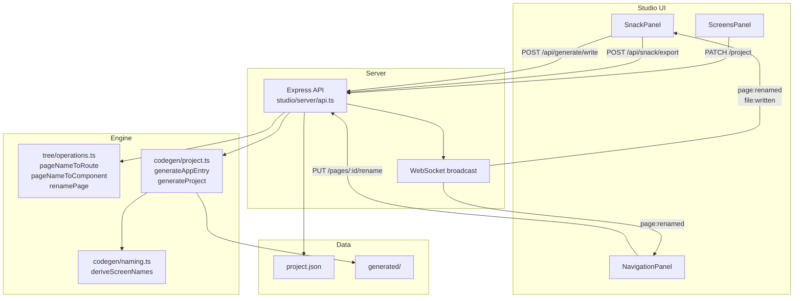

# Design Document: Studio Navigation & Screen Management

## Overview

This feature set adds five capabilities to Flipova Studio:

1. **Screen Renaming** — atomic rename of a page (name, route, nav entry) via a new `PUT /pages/:id/rename` endpoint.
2. **Screen Grouping** — organise generated screens into sub-folders via `ScreenGroup`, reflected in codegen paths and imports.
3. **Tab Navigation** — enhance the existing `generateAppEntry` tabs branch with Ionicons icons and `tabBarConfig` support.
4. **Drawer Navigation** — enhance the existing `generateAppEntry` drawer branch with Ionicons icons, `drawerConfig` support, and the required `react-native-gesture-handler` first-import.
5. **Real-time Snack Sync** — bidirectional sync: local `file:written` events push to Snack; Snack file edits are written back to `generated/` via `POST /api/generate/write`.

All five features are additive — they extend existing code paths without breaking current behaviour.

---

## Architecture



The server is the single source of truth. All mutations go through the REST API; the WebSocket is broadcast-only (server → clients).

---

## Components and Interfaces

### 1. Screen Renaming

#### New endpoint: `PUT /pages/:id/rename`

```typescript
// Request body
{ name: string }

// Success response (200)
{ id: string; name: string; route: string; oldRoute: string }

// Error responses
// 400 — empty/whitespace name
// 404 — page not found
// 409 — route collision with another page
```

The handler:
1. Validates `name` (non-empty, non-whitespace) → 400 on failure.
2. Derives `newRoute = pageNameToRoute(name)` and checks for collision → 409 on conflict.
3. Updates `page.name`, `page.route`, and the matching `NavigationScreen.name` in one `saveProject` call.
4. Broadcasts `page:renamed` with `{ id, name, route, oldRoute }`.

#### New tree operation: `renamePage`

```typescript
// studio/engine/tree/operations.ts
export function renamePage(
  project: ProjectDocument,
  pageId: string,
  newName: string,
): { project: ProjectDocument; oldRoute: string }
```

Pure function — returns a new project with the page and nav screen updated. The server handler calls this then saves.

#### Studio state handler

`StudioProvider` listens for `page:renamed` on the WebSocket and applies:

```typescript
setProject(prev => {
  if (!prev) return prev;
  const pages = prev.pages.map(p =>
    p.id === event.id ? { ...p, name: event.name, route: event.route } : p
  );
  const screens = prev.navigation.screens.map(s =>
    s.pageId === event.id ? { ...s, name: event.name } : s
  );
  return { ...prev, pages, navigation: { ...prev.navigation, screens } };
});
```

---

### 2. Screen Grouping

#### Codegen path resolution

`generateProject` (in `project.ts`) resolves the output path for each screen:

```typescript
function resolveScreenPath(page: PageDocument, project: ProjectDocument): string {
  const group = project.screenGroups?.find(g => g.screenIds.includes(page.id));
  const names = deriveScreenNames(page.name, page.route);
  if (group) {
    const folder = group.name.toLowerCase().replace(/[^a-z0-9]+/g, '-').replace(/^-|-$/g, '');
    return `src/screens/${folder}/${names.componentName}.tsx`;
  }
  return `src/screens/${names.componentName}.tsx`;
}
```

The same helper is used for both the file path and the import in `App.tsx`.

#### Server: group membership

`PATCH /project` (existing `PUT /project`) already persists the full project. No new endpoint is needed — the studio sends the updated `screenGroups` array as part of a full project update. Alternatively, a targeted `PUT /screen-groups/:id` can be added for efficiency, but the minimal approach uses the existing `PUT /project`.

#### Group deletion

When a group is deleted, the server removes all `pageId` references from `screenGroups` before saving. This is handled client-side in `StudioProvider.removeScreenGroup` which already exists.

---

### 3. Tab Navigation

`generateAppEntry` already has a `navType === "tabs"` branch. The enhancement:

- Replace `Feather` icon references with `Ionicons` from `@expo/vector-icons`.
- Default icon: `"ellipse"` when `NavigationScreen.icon` is not set.
- Apply `tabBarConfig` to `screenOptions` on the `Tab.Navigator`.
- Each `Tab.Screen` uses `NavigationScreen.name` as the label.

```typescript
// Inside generateAppEntry, tabs branch
const tabScreens = screens.map(({ page, names }) => {
  const sc = project.navigation.screens.find(s => s.pageId === page.id);
  const icon = sc?.icon ?? 'ellipse';
  const label = sc?.name ?? page.name;
  return `  <Tab.Screen
    name="${page.name}"
    component={${names.componentName}}
    options={{
      title: "${label}",
      tabBarIcon: ({ color, size }) => <Ionicons name="${icon}" size={size} color={color} />,
    }}
  />`;
}).join('\n');
```

`tabBarConfig` maps to `screenOptions`:

| `tabBarConfig` field | `screenOptions` key |
|---|---|
| `backgroundColor` | `tabBarStyle.backgroundColor` |
| `activeTintColor` | `tabBarActiveTintColor` |
| `inactiveTintColor` | `tabBarInactiveTintColor` |
| `showLabels: false` | `tabBarShowLabel: false` |

---

### 4. Drawer Navigation

`generateAppEntry` already has a `navType === "drawer"` branch. The enhancement:

- Add `import 'react-native-gesture-handler';` as the **first line** of `App.tsx`.
- Replace `Feather` with `Ionicons`.
- Apply `drawerConfig` to `screenOptions`.
- Each `Drawer.Screen` uses `NavigationScreen.name` as the label.

`drawerConfig` maps to `screenOptions`:

| `drawerConfig` field | `screenOptions` key |
|---|---|
| `backgroundColor` | `drawerStyle.backgroundColor` |
| `activeTintColor` | `drawerActiveTintColor` |
| `inactiveTintColor` | `drawerInactiveTintColor` |
| `drawerPosition` | `drawerPosition` |

#### New type: `DrawerConfig`

```typescript
// studio/engine/tree/types.ts — add to ProjectDocument
drawerConfig?: DrawerConfig;

export interface DrawerConfig {
  backgroundColor?: string;
  activeTintColor?: string;
  inactiveTintColor?: string;
  drawerPosition?: 'left' | 'right';
}
```

---

### 5. Real-time Snack Sync

#### Current state

`SnackPanel` already handles `file:written` → push to Snack (one direction). The `snack-sdk` state listener only tracks `connectedClients` and `url`.

#### Bidirectional sync additions

**Local → Snack** (already works, no change needed)

**Snack → Local** (new):

```typescript
// Inside SnackPanel, after snack.addStateListener for connectedClients/url:
let _lastKnownFiles: Record<string, { contents: string }> = {};
const _pendingWrites = new Map<string, ReturnType<typeof setTimeout>>();

snack.addStateListener((state) => {
  // existing: connectedClients, url
  
  // new: detect changed files
  for (const [filePath, file] of Object.entries(state.files ?? {})) {
    const known = _lastKnownFiles[filePath];
    const contents = (file as any).contents ?? '';
    if (known?.contents === contents) continue; // unchanged
    
    // debounce per file
    clearTimeout(_pendingWrites.get(filePath));
    _pendingWrites.set(filePath, setTimeout(async () => {
      _pendingWrites.delete(filePath);
      try {
        await fetch(`${API}/generate/write`, {
          method: 'POST',
          headers: { 'Content-Type': 'application/json' },
          body: JSON.stringify({ path: filePath, content: contents }),
        });
        _lastKnownFiles[filePath] = { contents };
        setSyncDirection('pull');
        setLastUpdated(new Date());
      } catch (e) {
        console.error('[SnackPanel] Snack→local write failed:', e);
        setSyncError(true);
      }
    }, 500));
  }
});
```

**Sync direction indicator**: a new `syncDirection` state (`'push' | 'pull' | null`) drives a small badge in the UI:
- `'push'` (↑) — local file written to Snack
- `'pull'` (↓) — Snack file written back locally

**Cleanup on close**: `closeSnack` cancels all pending debounced writes and resets `_lastKnownFiles`.

---

## Data Models

### `ProjectDocument` additions

```typescript
// Already exists in types.ts — no change needed:
screenGroups?: ScreenGroup[];
tabBarConfig?: TabBarConfig;

// New field:
drawerConfig?: DrawerConfig;
```

### `DrawerConfig` (new)

```typescript
export interface DrawerConfig {
  backgroundColor?: string;
  activeTintColor?: string;
  inactiveTintColor?: string;
  drawerPosition?: 'left' | 'right';
}
```

### `ScreenGroup` (already exists, no change)

```typescript
export interface ScreenGroup {
  id: string;
  name: string;
  type: "tabs" | "stack" | "drawer" | "auth" | "protected" | "custom";
  screenIds: string[];
  requireAuth?: boolean;
  redirectTo?: string;
}
```

### `NavigationScreen` (already exists, `icon` field already present)

```typescript
export interface NavigationScreen {
  name: string;
  pageId: string;
  icon?: string;   // Ionicons icon name
  // ...
}
```

### `renamePage` operation result

```typescript
interface RenameResult {
  project: ProjectDocument;
  oldRoute: string;
}
```

---

## Correctness Properties

*A property is a characteristic or behavior that should hold true across all valid executions of a system — essentially, a formal statement about what the system should do. Properties serve as the bridge between human-readable specifications and machine-verifiable correctness guarantees.*

### Property 1: Rename derives consistent names

*For any* non-empty page name string, the `route` stored after a rename must equal `pageNameToRoute(name)` and the component name derivable from that route must equal `pageNameToComponent(name)`. Both derivations must be consistent with the functions used at page creation.

**Validates: Requirements 1.2, 1.3**

---

### Property 2: Rename rejects invalid names

*For any* string composed entirely of whitespace characters (including the empty string), submitting it as a rename should be rejected with HTTP 400, and the project state should remain unchanged.

**Validates: Requirements 1.6**

---

### Property 3: Rename rejects route collisions

*For any* project containing two or more pages, renaming one page to a name whose derived route equals the route of another existing page should be rejected with HTTP 409, and the project state should remain unchanged.

**Validates: Requirements 1.7**

---

### Property 4: Rename updates all three fields atomically

*For any* page in a project, after a successful rename the stored `PageDocument.name`, `PageDocument.route`, and the corresponding `NavigationScreen.name` should all reflect the new name, and no partial update should be observable.

**Validates: Requirements 1.1**

---

### Property 5: Rename produces correct codegen path

*For any* project where a page has been renamed, the set of generated file paths should contain `src/screens/{NewComponentName}.tsx` and should not contain `src/screens/{OldComponentName}.tsx`.

**Validates: Requirements 1.8**

---

### Property 6: Screen path reflects group membership

*For any* project and any page, if the page belongs to a `ScreenGroup` with name `G`, the generated file path should be `src/screens/{normalize(G)}/{ComponentName}.tsx` and the corresponding import in `App.tsx` should reference that same sub-folder path. If the page belongs to no group, the path should be the flat `src/screens/{ComponentName}.tsx`.

**Validates: Requirements 2.3, 2.4, 2.5**

---

### Property 7: Group name normalisation is consistent

*For any* `ScreenGroup.name` string, the sub-folder name used in codegen should equal the name lowercased with all non-alphanumeric runs replaced by a single hyphen and leading/trailing hyphens stripped.

**Validates: Requirements 2.6**

---

### Property 8: Group deletion removes all page references

*For any* project, after a `ScreenGroup` is deleted, no remaining `ScreenGroup` in `screenGroups` should contain any of the deleted group's former `screenIds`.

**Validates: Requirements 2.7**

---

### Property 9: Tabs codegen correctness

*For any* project where `navigation.type` is `"tabs"`, the generated `App.tsx` should import `createBottomTabNavigator` from `@react-navigation/bottom-tabs`, the generated `package.json` should list `@react-navigation/bottom-tabs` as a dependency, and each tab screen's label should equal the corresponding `NavigationScreen.name`.

**Validates: Requirements 3.1, 3.2, 3.8**

---

### Property 10: Icon rendering in tabs and drawer

*For any* `NavigationScreen` with an `icon` field set, the generated `App.tsx` should reference `Ionicons` and include the specified icon name in the screen options. For any `NavigationScreen` without an `icon` field in a tabs navigator, the generated code should use `"ellipse"` as the default icon name.

**Validates: Requirements 3.3, 3.4, 4.4**

---

### Property 11: Tab bar config applied to screen options

*For any* project with `navigation.type === "tabs"` and a non-empty `tabBarConfig`, every configured field (`backgroundColor`, `activeTintColor`, `inactiveTintColor`, `showLabels`) should appear in the generated `screenOptions` of the tab navigator.

**Validates: Requirements 3.5**

---

### Property 12: Drawer codegen correctness

*For any* project where `navigation.type` is `"drawer"`, the generated `App.tsx` should have `import 'react-native-gesture-handler'` as its first import, should import `createDrawerNavigator` from `@react-navigation/drawer`, the generated `package.json` should list both `@react-navigation/drawer` and `react-native-gesture-handler`, and each drawer item's label should equal the corresponding `NavigationScreen.name`.

**Validates: Requirements 4.1, 4.2, 4.3, 4.8**

---

### Property 13: Drawer config applied to screen options

*For any* project with `navigation.type === "drawer"` and a non-empty `drawerConfig`, every configured field (`backgroundColor`, `activeTintColor`, `inactiveTintColor`, `drawerPosition`) should appear in the generated `screenOptions` of the drawer navigator.

**Validates: Requirements 4.5**

---

### Property 14: Snack-to-local debounce and dedup

*For any* sequence of Snack state updates where the same file is updated N times within a 500 ms window, exactly one `POST /api/generate/write` call should be made for that file after the debounce period. If the file content in the final update is identical to the last-written content, no write call should be made at all.

**Validates: Requirements 5.4, 5.5**

---

### Property 15: Snack session cleanup stops writes

*For any* SnackPanel session, after the session is closed, no `POST /api/generate/write` calls should be made even if Snack state change events arrive after the close.

**Validates: Requirements 5.7**

---

## Error Handling

| Scenario | Behaviour |
|---|---|
| Rename with empty/whitespace name | Server returns HTTP 400 `{ error: "Name cannot be empty" }` |
| Rename with colliding route | Server returns HTTP 409 `{ error: "Route already exists: {route}" }` |
| Rename for unknown page ID | Server returns HTTP 404 `{ error: "Page not found" }` |
| Codegen with missing ScreenGroup reference | Treat page as ungrouped (flat path) |
| `POST /api/generate/write` fails in SnackPanel | Log to console, set `syncError: true` to show non-blocking warning badge |
| Snack SDK state listener throws | Catch and log; do not crash the panel |
| Path traversal in `/generate/write` | Server validates path stays within `generated/` directory; returns 403 otherwise (already implemented) |

---

## Testing Strategy

### Unit tests

Focus on specific examples, edge cases, and integration points:

- `renamePage` operation: verify all three fields update, verify old route is returned.
- `pageNameToRoute` / `pageNameToComponent`: spot-check known inputs/outputs.
- `resolveScreenPath`: grouped page → sub-folder path; ungrouped → flat path.
- `PUT /pages/:id/rename` endpoint: 400 on empty name, 409 on collision, 200 on success with correct payload.
- `generateAppEntry` tabs: snapshot test with a 2-screen tabs project.
- `generateAppEntry` drawer: snapshot test verifying first import is `react-native-gesture-handler`.
- SnackPanel `page:renamed` handler: given event, state should update without reload.

### Property-based tests

Use **fast-check** (TypeScript) for all property tests. Each test runs a minimum of **100 iterations**.

Each test is tagged with a comment in the format:
`// Feature: studio-navigation-screen-management, Property N: <property text>`

| Property | Test description |
|---|---|
| P1 | For any non-empty name, `pageNameToRoute(name)` round-trips through rename |
| P2 | For any whitespace-only string, rename returns 400 |
| P3 | For any two-page project with colliding routes, rename returns 409 |
| P4 | For any valid rename, all three fields are updated atomically |
| P5 | For any renamed page, generated paths contain new name and not old name |
| P6 | For any page/group assignment, generated path matches group membership |
| P7 | For any group name, normalised folder name matches the spec formula |
| P8 | For any group deletion, no remaining group contains the deleted group's page IDs |
| P9 | For any tabs project, generated App.tsx and package.json are correct |
| P10 | For any screen with/without icon, generated icon reference is correct |
| P11 | For any tabBarConfig, all fields appear in generated screenOptions |
| P12 | For any drawer project, generated App.tsx and package.json are correct |
| P13 | For any drawerConfig, all fields appear in generated screenOptions |
| P14 | For any burst of N file updates within 500 ms, exactly one write is made |
| P15 | After session close, no writes occur on subsequent state events |

**Property-based testing library**: `fast-check` (`npm install --save-dev fast-check`)

Each correctness property is implemented by a single property-based test. Unit tests handle specific examples and error conditions. Together they provide comprehensive coverage.
