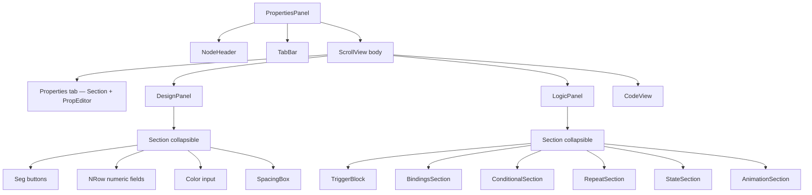
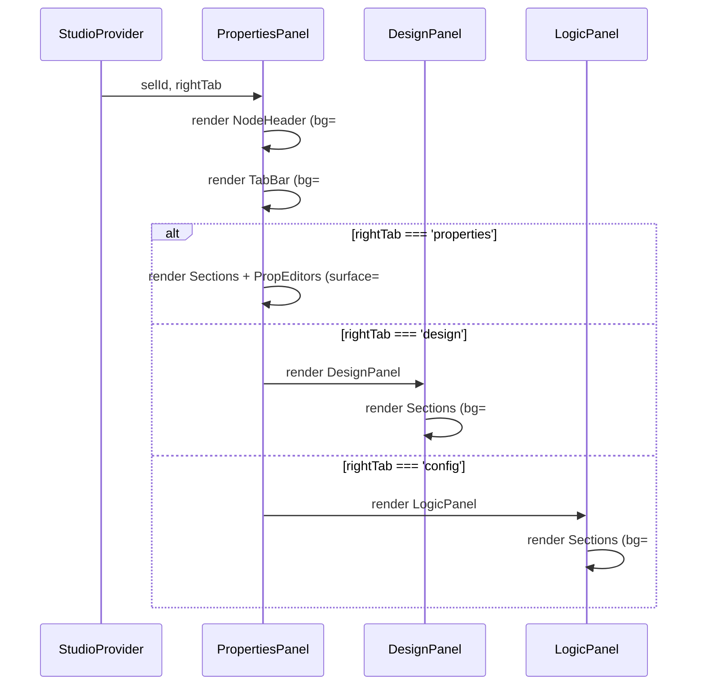

# Design Document: Studio Right Panel Redesign

## Overview

Appliquer le même langage visuel que le `Topbar.tsx` au panneau droit du studio — `PropertiesPanel`, `DesignPanel` et `LogicPanel` — pour obtenir une interface cohérente, dense et moderne. Le redesign conserve toute la logique existante et ne modifie que les styles, la typographie, les espacements et la hiérarchie visuelle.

Le panneau droit est une colonne fixe (~280 px) qui contient : un header de nœud, une barre d'onglets (Properties / Design / Logic / Code), puis le contenu scrollable de l'onglet actif. La contrainte principale est de travailler **en colonne** pour éviter tout débordement horizontal.

---

## Architecture



---

## Palette de couleurs (identique au Topbar)

| Token | Valeur | Usage |
|-------|--------|-------|
| `C.bg` | `#07090f` | Fond principal du panneau, header, tab bar |
| `C.surface` | `#0d1220` | Fond du root, sections, cards |
| `C.surface2` | `#131a2e` | Inputs, boutons, code blocks |
| `C.border` | `#1a2240` | Toutes les bordures et séparateurs |
| `C.text` | `#d0d8f0` | Texte principal |
| `C.muted` | `#4a5470` | Labels secondaires, placeholders, icônes inactives |
| `C.primary` | `#3b82f6` | Onglet actif, accents, icône de nœud |

> Note : `PropertiesPanel` utilise actuellement `C.bg = '#080c18'` et `C.muted = '#6a7494'`. Ces valeurs seront alignées sur celles du Topbar (`#07090f` et `#4a5470`).

---

## Composants et Interfaces

### 1. PropertiesPanel — NodeHeader

**Avant** : fond `C.bg` (#080c18), icône 16 px, nom en 13/700, kind en 9px uppercase.

**Après** :
- `backgroundColor: C.bg` (#07090f), `borderBottomColor: C.border`
- Icône kind dans un badge 22×22 `borderRadius: 6`, `backgroundColor: C.primary + '20'`
- Nom du nœud : `fontSize: 13`, `fontWeight: '700'`, `letterSpacing: -0.2`, `color: C.text`
- Badge kind : `fontSize: 9`, `fontWeight: '600'`, `color: C.muted`, `textTransform: 'uppercase'`, `letterSpacing: 0.8`
- Variant pills : `backgroundColor: C.surface2`, `borderColor: C.border`, `borderRadius: 5`, `paddingHorizontal: 7`, `paddingVertical: 3`
- Variant pill active : `backgroundColor: C.primary`, `borderColor: C.primary`

```typescript
interface NodeHeaderStyles {
  header: { backgroundColor: C.bg; borderBottomWidth: 1; borderBottomColor: C.border; paddingHorizontal: 12; paddingVertical: 9 }
  headerRow: { flexDirection: 'row'; alignItems: 'center'; gap: 8 }
  kindBadge: { width: 22; height: 22; borderRadius: 6; backgroundColor: string; alignItems: 'center'; justifyContent: 'center' }
  headerName: { color: C.text; fontSize: 13; fontWeight: '700'; letterSpacing: -0.2; flex: 1 }
  headerKind: { color: C.muted; fontSize: 9; fontWeight: '600'; textTransform: 'uppercase'; letterSpacing: 0.8 }
}
```

### 2. PropertiesPanel — TabBar

**Avant** : tabs flex, `paddingVertical: 8`, texte 10px/600, bordure bottom 2px active.

**Après** :
- Container : `backgroundColor: C.bg`, `borderBottomWidth: 1`, `borderBottomColor: C.border`, `paddingHorizontal: 4`
- Tab : `paddingVertical: 9`, `paddingHorizontal: 10`, `borderRadius: 0`
- Tab actif : indicateur bottom `height: 2`, `backgroundColor: C.primary`, `borderRadius: 1`
- Texte inactif : `color: C.muted`, `fontSize: 11`, `fontWeight: '500'`
- Texte actif : `color: C.primary`, `fontWeight: '600'`

### 3. PropertiesPanel — Section (onglet Properties)

**Avant** : `borderBottomColor: 'rgba(26,34,64,0.6)'`, header `paddingVertical: 8`.

**Après** :
- Section : `borderBottomWidth: 1`, `borderBottomColor: C.border`
- Header : `paddingHorizontal: 12`, `paddingVertical: 9`, `backgroundColor: C.bg`
- Icône groupe dans badge 20×20 `borderRadius: 5`
- Titre : `fontSize: 11`, `fontWeight: '600'`, `color: C.text`, `letterSpacing: -0.1`
- Body : `paddingHorizontal: 12`, `paddingBottom: 12`, `paddingTop: 6`, `backgroundColor: C.surface`

### 4. PropEditor

**Avant** : styles minimaux, pas de conteneur visuel.

**Après** :
- Chaque prop dans un conteneur `backgroundColor: C.surface`, `borderRadius: 6`, `padding: 8`, `marginBottom: 4`
- Label de prop : `fontSize: 10`, `fontWeight: '600'`, `color: C.muted`, `marginBottom: 4`
- Bound indicator : badge `backgroundColor: '#a78bfa20'`, `borderRadius: 4`, `paddingHorizontal: 5`
- Boutons auto/reset : style cohérent avec les icon buttons du Topbar (30×22, `borderRadius: 5`)

### 5. DesignPanel — Section

**Avant** : `s.section` avec `borderBottomColor` opaque, `sHead` avec `paddingVertical: 8`.

**Après** :
- Section : `borderBottomWidth: 1`, `borderBottomColor: C.border`
- sHead : `paddingHorizontal: 12`, `paddingVertical: 9`, `backgroundColor: C.bg`
- sIcon : 22×22, `borderRadius: 6` (au lieu de 24×24 `borderRadius: 6`)
- sTitle : `fontSize: 11`, `fontWeight: '700'`, `color: C.text`, `letterSpacing: -0.1`
- sDesc : `fontSize: 10`, `color: C.muted`, `lineHeight: 14`, `marginBottom: 8`
- sBody : `paddingHorizontal: 12`, `paddingTop: 8`, `paddingBottom: 14`, `backgroundColor: C.surface`

### 6. DesignPanel — Seg buttons

**Avant** : `segBtn` avec `backgroundColor: C.s2`, `borderRadius: 5`, `paddingHorizontal: 7`, `paddingVertical: 5`.

**Après** :
- `backgroundColor: C.surface2`, `borderRadius: 6`, `borderWidth: 1`, `borderColor: C.border`
- `paddingHorizontal: 8`, `paddingVertical: 5`
- Actif : `backgroundColor: color`, `borderColor: color`
- Texte : `fontSize: 10`, `fontWeight: '500'`, `color: C.muted`
- Texte actif : `color: '#fff'`, `fontWeight: '600'`

### 7. DesignPanel — Numeric fields (N)

**Avant** : `nInput` avec `backgroundColor: C.s2`, `borderRadius: 5`, `fontSize: 11`.

**Après** :
- Container `nWrap` : `backgroundColor: C.surface2`, `borderRadius: 6`, `borderWidth: 1`, `borderColor: C.border`, `paddingHorizontal: 8`, `paddingVertical: 5`
- Label : `fontSize: 9`, `fontWeight: '500'`, `color: C.muted`, `marginBottom: 2`
- Input : `fontSize: 11`, `color: C.text`, `fontWeight: '500'`

### 8. DesignPanel — Sub labels

**Avant** : `sub` avec `fontSize: 9`, `color: C.muted`, `marginTop: 8`.

**Après** :
- `fontSize: 9`, `fontWeight: '700'`, `color: C.muted`, `letterSpacing: 0.6`, `textTransform: 'uppercase'`, `marginTop: 10`, `marginBottom: 4`

### 9. LogicPanel — Section

**Avant** : `sHead` avec `paddingVertical: 10`, `sIconBox` 24×24.

**Après** :
- Section : `borderBottomWidth: 1`, `borderBottomColor: C.border`
- Active : `borderLeftWidth: 2`, `borderLeftColor: color`
- sHead : `paddingHorizontal: 12`, `paddingVertical: 9`, `backgroundColor: C.bg`
- sIconBox : 22×22, `borderRadius: 6`
- sTitle : `fontSize: 11`, `fontWeight: '700'`, `color: C.text` (actif) / `C.muted` (inactif)
- sSubtitle : `fontSize: 9`, `color: C.muted`, `marginTop: 1`
- sBody : `paddingHorizontal: 12`, `paddingBottom: 14`, `paddingTop: 6`, `backgroundColor: C.surface`

### 10. LogicPanel — Add trigger button

**Avant** : `addBtn` avec `borderStyle: 'dashed'`, `borderColor: 'rgba(245,158,11,0.35)'`.

**Après** :
- Même style dashed mais avec `borderRadius: 7`, `paddingVertical: 9`
- Texte : `fontSize: 11`, `fontWeight: '600'`

---

## Séquence de rendu (panneau droit)



---

## Modèles de données

Aucun changement de modèle de données — le redesign est purement visuel (StyleSheet uniquement).

---

## Stratégie de test

### Tests unitaires

- Vérifier que `PropertiesPanel` rend sans erreur avec un nœud sélectionné et sans nœud sélectionné
- Vérifier que les 4 onglets sont présents et que le changement d'onglet fonctionne
- Vérifier que `Section` dans `DesignPanel` et `LogicPanel` toggle correctement

### Tests de non-régression visuelle

- Snapshot des styles clés (backgroundColor, borderColor, fontSize) pour détecter toute régression
- Vérifier que `C.bg = '#07090f'` est utilisé dans les headers/tab bars des 3 fichiers
- Vérifier que `C.surface = '#0d1220'` est utilisé dans les bodies de sections

### Tests de responsivité

- Vérifier que la disposition en colonne ne déborde pas à 240 px de largeur
- Vérifier que les Seg buttons wrappent correctement sans overflow horizontal

---

## Considérations de performance

- Aucun impact : les changements sont limités aux `StyleSheet.create()` — pas de logique supplémentaire
- Les `StyleSheet` sont statiques et calculés une seule fois au chargement du module

---

## Dépendances

- `@expo/vector-icons` (Feather) — déjà utilisé, aucun changement
- Palette `C` alignée sur `Topbar.tsx` — à dupliquer dans chaque fichier (pas d'import partagé pour éviter les couplages)
