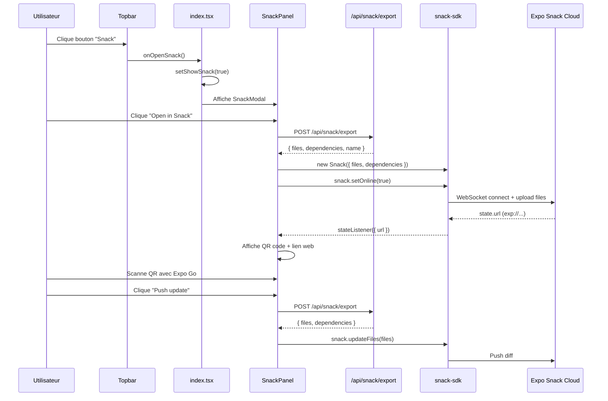

# Design Document: Studio Snack Expo Integration

## Overview

Ce document décrit l'intégration complète d'Expo Snack dans Flipova Studio, permettant à l'utilisateur d'envoyer son projet en cours vers Expo Snack et de le tester en temps réel sur un appareil physique via un QR code scannable. L'intégration couvre le point d'accès UI, le flux complet de création/mise à jour du Snack, l'affichage d'un vrai QR code, la compatibilité `snack-sdk` côté web, et la stratégie de test.

Le `SnackPanel` existe déjà avec une UI complète et un endpoint `/api/snack/export` fonctionnel. Le travail consiste à (1) exposer le panneau dans l'UI, (2) ajouter un vrai QR code, (3) résoudre la compatibilité `snack-sdk` côté web, et (4) couvrir le tout par des tests.

---

## Architecture

### Vue d'ensemble

```mermaid
graph TD
    subgraph Studio UI
        TB[Topbar]
        TB -->|onOpenSnack| IDX[index.tsx]
        IDX -->|showSnack state| SM[SnackModal]
        SM --> SP[SnackPanel]
    end

    subgraph SnackPanel
        SP -->|POST /api/snack/export| API[Server API]
        SP -->|new Snack\(\)| SDK[snack-sdk]
        SDK -->|WebSocket| SNACK[Expo Snack Cloud]
        SP --> QR[QRCode component]
    end

    subgraph Server
        API -->|generateProject\(\)| GEN[Code Generator]
        GEN -->|files + deps| API
    end

    SNACK -->|exp:// URL| SDK
    SDK -->|state.url| SP
    QR -->|renders| QRIMG[QR Code Image]
```

### Flux principal



---

## Components and Interfaces

### Component 1: Bouton Snack dans Topbar

**Purpose**: Point d'entrée unique pour ouvrir le panneau Snack depuis la barre d'outils.

**Interface**:
```typescript
interface TopbarProps {
  // Existant
  onOpenTheme: () => void;
  onOpenSettings: () => void;
  // ... autres existants ...

  // Nouveau
  onOpenSnack: () => void;
}
```

**Responsabilités**:
- Afficher un bouton icône `smartphone` avec tooltip "Expo Snack — Tester sur un appareil réel"
- Appeler `onOpenSnack()` au clic
- Positionné entre le bouton "Fonctions" et "Paramètres" dans la barre droite

---

### Component 2: SnackModal (nouveau wrapper)

**Purpose**: Modal plein-écran (ou panneau latéral flottant) qui encapsule le `SnackPanel` existant.

**Interface**:
```typescript
interface SnackModalProps {
  visible: boolean;
  onClose: () => void;
}
```

**Responsabilités**:
- Afficher le `SnackPanel` dans un conteneur positionné (modal ou drawer)
- Gérer la fermeture via bouton ou touche Escape
- Largeur fixe ~320px, positionnée en overlay sur le panneau droit

**Décision de placement**: Modal flottante ancrée en haut à droite (overlay), plutôt qu'un onglet dans `PropertiesPanel`. Raisons :
- Le `SnackPanel` est indépendant de la sélection d'un élément
- Évite de surcharger les onglets de `PropertiesPanel`
- Cohérent avec les autres modals (ThemeEditorModal, ServiceConnectorModal, etc.)

---

### Component 3: SnackPanel (existant — modifications)

**Purpose**: Panneau de contrôle Expo Snack avec QR code visuel.

**Modifications requises**:
```typescript
// Ajout dans SnackPanel.tsx
import QRCode from 'react-native-qrcode-svg';

// Dans le rendu "online", remplacer le qrHint par un vrai QR code
{snackUrl && (
  <View style={s.qrContainer}>
    <QRCode
      value={snackUrl}
      size={160}
      backgroundColor="#080c18"
      color="#d0d8f0"
    />
    <Text style={s.qrCaption}>Scanner avec Expo Go</Text>
  </View>
)}
```

**Interface complète (inchangée)**:
```typescript
// Pas de props — le composant est autonome
export const SnackPanel: React.FC = () => { ... }
```

---

### Component 4: Endpoint `/api/snack/export` (existant — aucune modification)

**Purpose**: Génère les fichiers du projet au format snack-sdk.

**Interface**:
```typescript
// POST /api/snack/export
// Response:
interface SnackExportResponse {
  files: Record<string, { type: 'CODE'; contents: string }>;
  dependencies: Record<string, { version: string }>;
  name: string;
}
```

---

## Data Models

### SnackState (état interne du SnackPanel)

```typescript
type SnackStatus = 'idle' | 'loading' | 'online' | 'error';

interface SnackPanelState {
  status: SnackStatus;
  snackUrl: string | null;      // exp://... pour Expo Go / QR code
  webUrl: string | null;        // https://snack.expo.dev/... pour navigateur
  error: string | null;
  connectedClients: number;
  lastUpdated: Date | null;
}
```

**Règles de validation**:
- `snackUrl` doit commencer par `exp://` ou `https://` quand non-null
- `connectedClients >= 0` toujours
- `status === 'online'` implique `snackUrl !== null`

---

## Compatibilité snack-sdk côté web

### Problème

`snack-sdk` utilise des APIs Node.js (`ws`, `crypto`, etc.) qui ne sont pas disponibles nativement dans un contexte browser/Expo web.

### Solution : Polyfills via Metro

Dans `metro.config.js` du studio app, ajouter les résolutions de polyfills :

```javascript
// studio/app/metro.config.js
const { getDefaultConfig } = require('expo/metro-config');

const config = getDefaultConfig(__dirname);

config.resolver.extraNodeModules = {
  ...config.resolver.extraNodeModules,
  // Polyfills pour snack-sdk côté web
  crypto: require.resolve('expo-crypto'),
  stream: require.resolve('readable-stream'),
  buffer: require.resolve('@craftzdog/react-native-buffer'),
};

module.exports = config;
```

**Dépendances à ajouter** dans `studio/app/package.json` :
```json
{
  "dependencies": {
    "snack-sdk": "^6.6.2",
    "react-native-qrcode-svg": "^6.3.0",
    "react-native-svg": "^15.0.0",
    "readable-stream": "^4.5.2",
    "@craftzdog/react-native-buffer": "^6.0.5"
  }
}
```

### Alternative si polyfills insuffisants

Si `snack-sdk` reste incompatible côté web malgré les polyfills, utiliser l'**API REST Snack** directement (sans WebSocket) :

```typescript
// Fallback : création via API REST Expo
async function createSnackViaREST(files, dependencies, name) {
  const response = await fetch('https://exp.host/--/api/v2/snack/save', {
    method: 'POST',
    headers: { 'Content-Type': 'application/json' },
    body: JSON.stringify({ files, dependencies, name, sdkVersion: '51.0.0' }),
  });
  const { id } = await response.json();
  return {
    webUrl: `https://snack.expo.dev/${id}`,
    // L'URL Expo Go n'est disponible qu'avec le SDK en mode online
    snackUrl: `https://snack.expo.dev/${id}`,
  };
}
```

Cette approche ne supporte pas le mode "live" (WebSocket), mais génère un lien partageable avec QR code.

---

## Algorithmic Pseudocode

### Algorithme principal : openInSnack()

```pascal
PROCEDURE openInSnack()
  INPUT: aucun (utilise l'état interne et l'API serveur)
  OUTPUT: met à jour l'état du composant (status, snackUrl, webUrl)

  PRECONDITIONS:
    - L'endpoint /api/snack/export est accessible
    - snack-sdk est disponible dans l'environnement

  POSTCONDITIONS:
    - Si succès : status = 'online', snackUrl ≠ null, webUrl ≠ null
    - Si erreur : status = 'error', error ≠ null

  BEGIN
    setStatus('loading')
    setError(null)

    TRY
      // Étape 1 : Récupérer les fichiers générés
      response ← fetch('/api/snack/export', { method: 'POST' })
      IF NOT response.ok THEN
        THROW Error('Server error: ' + response.status)
      END IF
      { files, dependencies, name } ← response.json()

      // Étape 2 : Nettoyer le Snack précédent
      IF snackRef.current ≠ null THEN
        snackRef.current.setOnline(false)
        snackRef.current ← null
      END IF

      // Étape 3 : Créer le Snack
      snack ← new Snack({ name, files, dependencies, online: false })

      // Étape 4 : Écouter les changements d'état
      snack.addStateListener(state →
        setConnectedClients(count(state.connectedClients))
        IF state.url ≠ null THEN setSnackUrl(state.url) END IF
      )

      snackRef.current ← snack

      // Étape 5 : Mettre en ligne
      snack.setOnline(true)
      state ← await snack.getStateAsync()
      setSnackUrl(state.url)

      // Étape 6 : Sauvegarder pour obtenir l'URL web
      saved ← await snack.saveAsync()
      setWebUrl('https://snack.expo.dev/' + saved.id)

      setLastUpdated(now())
      setStatus('online')

    CATCH error
      setError(error.message)
      setStatus('error')
    END TRY
  END
```

**Loop Invariants**: N/A (pas de boucle)

---

### Algorithme : pushUpdate()

```pascal
PROCEDURE pushUpdate()
  INPUT: snackRef.current (Snack instance existante)
  OUTPUT: met à jour les fichiers du Snack en ligne

  PRECONDITIONS:
    - snackRef.current ≠ null
    - status = 'online'

  POSTCONDITIONS:
    - Si succès : lastUpdated = now(), status = 'online'
    - Si erreur : status = 'error', error ≠ null

  BEGIN
    IF snackRef.current = null THEN RETURN END IF
    setStatus('loading')

    TRY
      response ← fetch('/api/snack/export', { method: 'POST' })
      IF NOT response.ok THEN THROW Error('Server error: ' + response.status) END IF
      { files, dependencies } ← response.json()

      snackRef.current.updateFiles(files)
      snackRef.current.updateDependencies(dependencies)

      setLastUpdated(now())
      setStatus('online')
    CATCH error
      setError(error.message)
      setStatus('error')
    END TRY
  END
```

---

### Algorithme : intégration dans index.tsx

```pascal
PROCEDURE StudioScreen()
  // État existant
  showTheme, showSettings, showServices, showQueries, showCode, showCustomFn : boolean

  // Nouvel état
  showSnack : boolean ← false

  RENDER
    <Topbar
      ...existant...
      onOpenSnack={() → setShowSnack(true)}
    />
    ...
    IF showSnack THEN
      <SnackModal
        visible={showSnack}
        onClose={() → setShowSnack(false)}
      />
    END IF
  END RENDER
END
```

---

## Key Functions with Formal Specifications

### `SnackPanel.openInSnack()`

**Préconditions**:
- `status !== 'loading'` (pas d'appel concurrent)
- Le serveur studio est accessible sur `/api`

**Postconditions**:
- `status === 'online'` ⟹ `snackUrl !== null && webUrl !== null`
- `status === 'error'` ⟹ `error !== null && error.length > 0`
- `snackRef.current !== null` ⟹ `status === 'online'`

**Invariants de boucle**: N/A

---

### `SnackPanel.pushUpdate()`

**Préconditions**:
- `snackRef.current !== null`
- `status === 'online'`

**Postconditions**:
- `status === 'online'` ⟹ `lastUpdated` est une date récente (≤ 5s avant now())
- `status === 'error'` ⟹ `snackRef.current` reste non-null (le Snack n'est pas détruit)

---

### `SnackPanel.closeSnack()`

**Préconditions**: aucune

**Postconditions**:
- `snackRef.current === null`
- `status === 'idle'`
- `snackUrl === null && webUrl === null`
- `connectedClients === 0`

---

## Example Usage

```typescript
// Dans index.tsx — ajout minimal
const [showSnack, setShowSnack] = useState(false);

// Dans le JSX de Topbar
<Topbar
  onOpenSnack={() => setShowSnack(true)}
  // ... autres props existantes
/>

// Nouveau modal
{showSnack && (
  <SnackModal visible={showSnack} onClose={() => setShowSnack(false)} />
)}
```

```typescript
// SnackModal.tsx — wrapper minimal
import React from 'react';
import { Modal, View, Pressable, StyleSheet } from 'react-native';
import { Feather } from '@expo/vector-icons';
import SnackPanel from '../SnackPanel';

export const SnackModal: React.FC<{ visible: boolean; onClose: () => void }> = ({ visible, onClose }) => (
  <Modal visible={visible} transparent animationType="fade" onRequestClose={onClose}>
    <Pressable style={s.backdrop} onPress={onClose}>
      <Pressable style={s.panel} onPress={e => e.stopPropagation()}>
        <View style={s.closeRow}>
          <Pressable onPress={onClose}><Feather name="x" size={14} color="#6a7494" /></Pressable>
        </View>
        <SnackPanel />
      </Pressable>
    </Pressable>
  </Modal>
);

const s = StyleSheet.create({
  backdrop: { flex: 1, backgroundColor: 'rgba(0,0,0,0.5)', justifyContent: 'flex-start', alignItems: 'flex-end' },
  panel: { width: 320, marginTop: 44, marginRight: 12, borderRadius: 12, overflow: 'hidden', backgroundColor: '#0d1220', borderWidth: 1, borderColor: '#1a2240', maxHeight: '90%' },
  closeRow: { flexDirection: 'row', justifyContent: 'flex-end', padding: 8 },
});
```

```typescript
// Ajout QR code dans SnackPanel.tsx (état 'online')
import QRCode from 'react-native-qrcode-svg';

// Remplace le bloc qrHint par :
{snackUrl && (
  <View style={s.qrContainer}>
    <QRCode value={snackUrl} size={160} backgroundColor="#080c18" color="#d0d8f0" />
    <Text style={s.qrCaption}>Scanner avec Expo Go</Text>
  </View>
)}
```

---

## Correctness Properties

*A property is a characteristic or behavior that should hold true across all valid executions of a system — essentially, a formal statement about what the system should do. Properties serve as the bridge between human-readable specifications and machine-verifiable correctness guarantees.*

### Property 1: Cohérence status/snackUrl

*For any* état du `SnackPanel`, si `status === 'online'` alors `snackUrl !== null`.

**Validates: Requirements 5.7**

### Property 2: Nettoyage complet à la fermeture

*For any* état du `SnackPanel`, après l'exécution de `closeSnack()`, `status === 'idle'` et `snackUrl === null` et `webUrl === null` et `connectedClients === 0`.

**Validates: Requirements 7.2**

### Property 3: Idempotence de pushUpdate sur les URLs

*For any* instance Snack active, appeler `pushUpdate()` deux fois de suite sans changement de projet ne doit pas modifier `snackUrl` ni `webUrl`.

**Validates: Requirements 6.3**

### Property 4: Isolation des erreurs de pushUpdate

*For any* instance Snack active en état `online`, si `POST /api/snack/export` retourne une erreur HTTP pendant `pushUpdate()`, alors `snackRef.current` reste non-null (l'instance Snack n'est pas détruite).

**Validates: Requirements 6.4**

### Property 5: Désactivation des boutons en état loading

*For any* état `loading` du `SnackPanel`, les boutons "Open in Snack" et "Push update" sont désactivés (non interactifs).

**Validates: Requirements 5.1, 6.5**

### Property 6: QR code rendu pour toute URL valide

*For any* valeur non-nulle de `snackUrl`, le composant `QRCode` reçoit cette valeur comme prop `value` et rend une image non-vide.

**Validates: Requirements 4.1, 12.3**

### Property 7: Toute erreur passe status à 'error'

*For any* appel à `openInSnack()`, si `POST /api/snack/export` retourne un code HTTP d'erreur ou si `snack-sdk` lève une exception, alors `status === 'error'` et `error !== null`.

**Validates: Requirements 5.8, 5.9**

### Property 8: Format des fichiers exportés

*For any* projet valide, tous les fichiers retournés par `POST /api/snack/export` ont `type === 'CODE'` et `contents` de type `string` non-null.

**Validates: Requirements 9.2, 12.2**

### Property 9: Exclusion des dépendances bundlées

*For any* projet valide, les dépendances retournées par `POST /api/snack/export` n'incluent jamais `react`, `react-native` ni `expo`.

**Validates: Requirements 9.4, 12.1**

### Property 10: Exclusion des fichiers de configuration

*For any* projet valide, les fichiers retournés par `POST /api/snack/export` ne contiennent aucun fichier dont le chemin se termine par `.yml` ou `.gitignore`.

**Validates: Requirements 9.3**

### Property 11: Construction de webUrl

*For any* `id` retourné par `snack.saveAsync()`, `webUrl` est exactement `https://snack.expo.dev/{id}`.

**Validates: Requirements 5.6**

---

## Error Handling

### Scénario 1 : Serveur inaccessible

**Condition**: `fetch('/api/snack/export')` échoue (réseau ou serveur down)
**Réponse**: `status = 'error'`, message "Failed to reach server"
**Récupération**: Bouton "Retry" visible, réessaie `openInSnack()`

### Scénario 2 : snack-sdk incompatible web

**Condition**: `new Snack()` ou `snack.setOnline(true)` lève une exception liée aux APIs Node.js
**Réponse**: Fallback automatique vers l'API REST Expo (`/--/api/v2/snack/save`)
**Récupération**: Mode "saved" sans live update — affiche le lien web + QR code statique

### Scénario 3 : Timeout Snack cloud

**Condition**: `snack.getStateAsync()` ne résout pas dans les 15 secondes
**Réponse**: `status = 'error'`, message "Snack connection timed out"
**Récupération**: Bouton "Retry"

### Scénario 4 : Projet vide (aucune page)

**Condition**: `generateProject()` retourne 0 fichiers utiles
**Réponse**: L'endpoint retourne `files: {}` — le Snack est créé mais affiche un projet vide
**Récupération**: Message informatif dans le panel "Ajoutez des pages à votre projet"

---

## Testing Strategy

### Unit Testing

**Fichiers cibles**:
- `studio/app/src/ui/__tests__/SnackPanel.test.tsx`
- `studio/server/__tests__/snack-export.test.ts`

**Cas de test unitaires**:
- `SnackPanel` en état `idle` : affiche le bouton "Open in Snack"
- `SnackPanel` en état `loading` : affiche le spinner, désactive les boutons
- `SnackPanel` en état `online` : affiche le QR code, les boutons "Push update" et "Close"
- `SnackPanel` en état `error` : affiche le message d'erreur et le bouton "Retry"
- `closeSnack()` : remet l'état à `idle` et null les URLs
- Endpoint `/api/snack/export` : retourne `files`, `dependencies`, `name` pour un projet valide
- Endpoint `/api/snack/export` : filtre les fichiers `.yml` et `.gitignore`
- Endpoint `/api/snack/export` : exclut `react`, `react-native`, `expo` des dépendances

### Property-Based Testing

**Bibliothèque**: `fast-check`

**Propriétés à tester**:

```typescript
// P1 : Pour tout projet valide, l'export ne contient jamais react/react-native/expo dans les deps
fc.property(fc.record({ pages: fc.array(pageArb) }), (project) => {
  const result = buildSnackDependencies(project);
  return !['react', 'react-native', 'expo'].some(pkg => pkg in result);
});

// P2 : Pour tout projet, les fichiers exportés ont tous type: 'CODE'
fc.property(fc.record({ pages: fc.array(pageArb) }), (project) => {
  const result = buildSnackFiles(project);
  return Object.values(result).every(f => f.type === 'CODE' && typeof f.contents === 'string');
});

// P3 : snackUrl non-null implique QR code rendu (test de rendu)
fc.property(fc.string({ minLength: 10 }), (url) => {
  const { getByTestId } = render(<SnackPanel initialUrl={url} />);
  return getByTestId('qr-code') !== null;
});
```

### Integration Testing

**Scénario**: Flux complet mock
1. Mock `fetch('/api/snack/export')` → retourne fixtures
2. Mock `snack-sdk` → simule `setOnline(true)` et `getStateAsync()`
3. Vérifier que le QR code est rendu avec la bonne URL
4. Vérifier que `pushUpdate()` appelle `snack.updateFiles()` avec les nouveaux fichiers

---

## Performance Considerations

- Le `SnackPanel` ne crée le Snack qu'à la demande (lazy) — pas d'impact au démarrage du studio
- `snack.setOnline(false)` est appelé au démontage du composant pour libérer la connexion WebSocket
- `pushUpdate()` envoie uniquement un diff via `snack-sdk` (pas de recréation complète)
- Le QR code est rendu côté client via `react-native-qrcode-svg` (SVG, pas d'appel réseau)

---

## Security Considerations

- L'endpoint `/api/snack/export` ne prend aucun paramètre utilisateur — pas de risque d'injection
- Les fichiers générés sont lus depuis le projet local uniquement
- La connexion WebSocket vers Expo Snack Cloud est gérée par `snack-sdk` (HTTPS/WSS)
- Aucune clé API ni token n'est exposé côté client

---

## Dependencies

| Dépendance | Version | Usage |
|---|---|---|
| `snack-sdk` | `^6.6.2` | Déjà installé — création et gestion du Snack |
| `react-native-qrcode-svg` | `^6.3.0` | À ajouter — rendu du QR code |
| `react-native-svg` | `^15.0.0` | À ajouter — peer dep de qrcode-svg |
| `readable-stream` | `^4.5.2` | À ajouter si nécessaire — polyfill Node.js stream |
| `@craftzdog/react-native-buffer` | `^6.0.5` | À ajouter si nécessaire — polyfill Node.js buffer |
| `fast-check` | `^3.x` | Dev — property-based testing |
