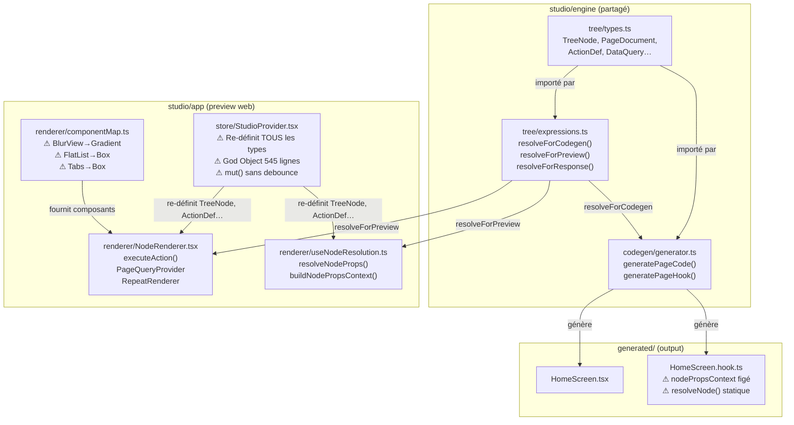
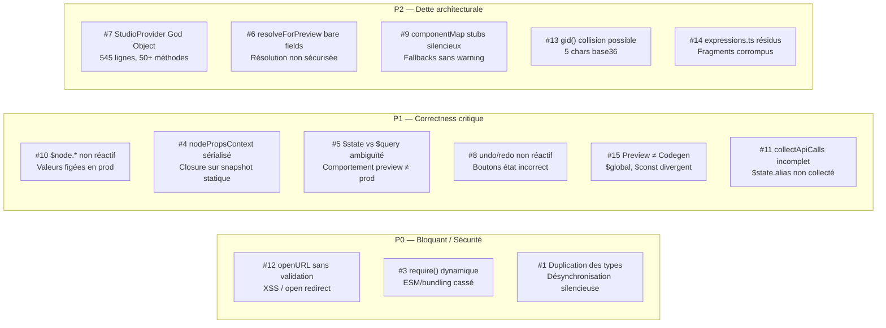
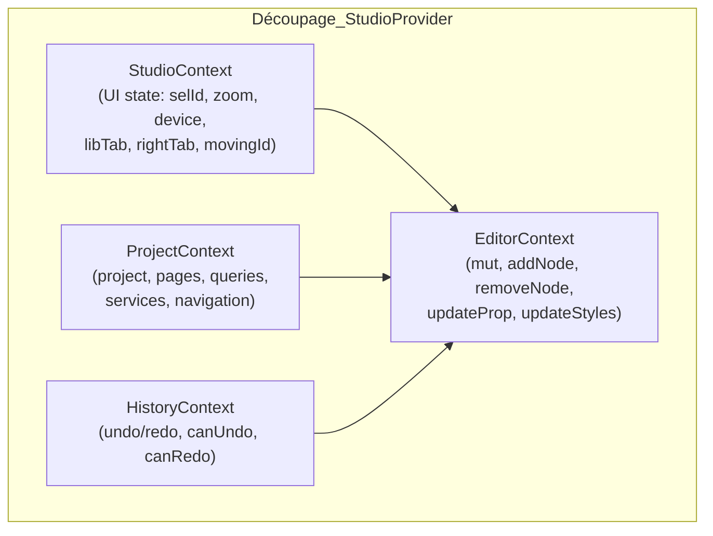
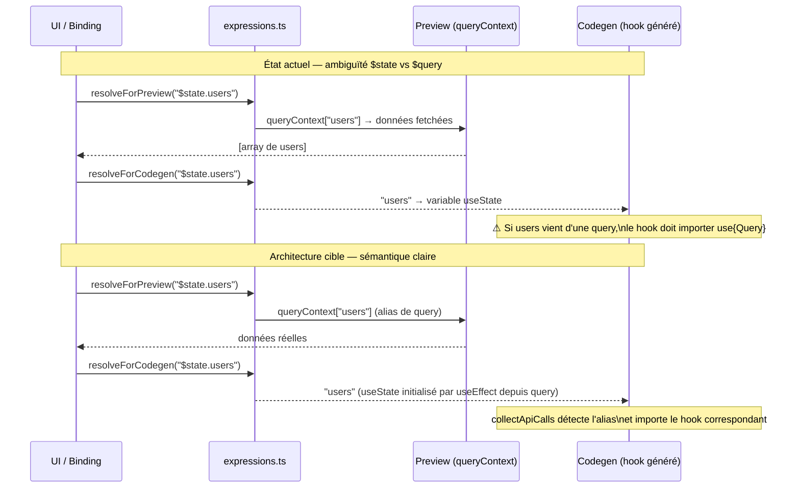
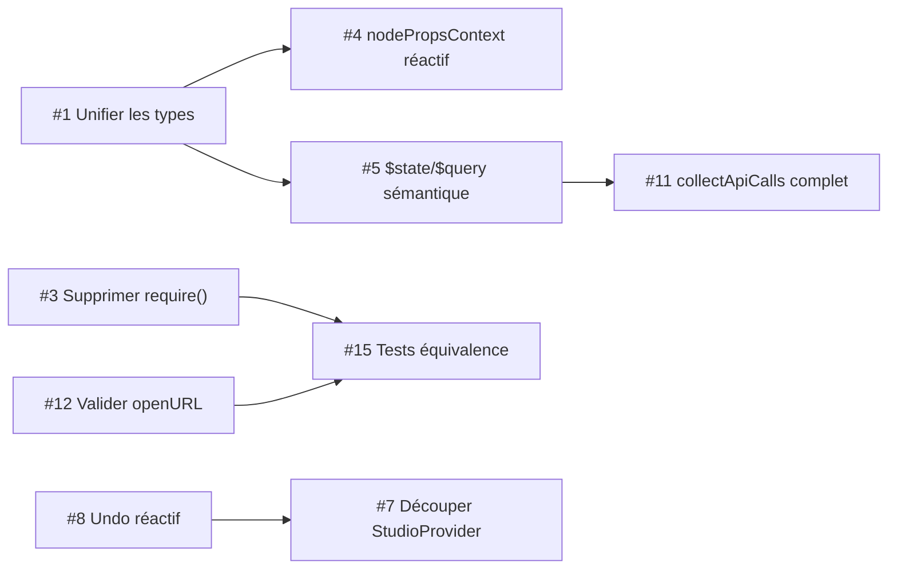

# Design Document : Audit Technique du Studio Flipova

## Vue d'ensemble

Le studio Flipova est un builder visuel React Native (no-code/low-code) composé d'un moteur de types (`engine/tree/types.ts`), d'un moteur d'expressions (`engine/tree/expressions.ts`), d'un générateur de code (`engine/codegen/generator.ts`), d'un store global (`app/src/store/StudioProvider.tsx`), et d'un renderer de preview (`app/src/renderer/`).

Ce document cartographie l'architecture actuelle, identifie les failles et dettes techniques, propose une architecture cible pour chaque problème, et définit les propriétés de correction testables. Les problèmes sont priorisés P0 (bloquant/sécurité), P1 (correctness critique), P2 (dette architecturale).

---

## Architecture actuelle



---

## Cartographie des failles

### Architecture globale



---

## Analyse détaillée et architecture cible

### #1 — Duplication des types (P0)

**État actuel :**
`StudioProvider.tsx` redéfinit localement `TreeNode`, `ActionDef`, `PageState`, `DataQuery`, `AnimationConfig` avec `any` partout, divergeant de `engine/tree/types.ts` (source of truth avec types stricts).

```typescript
// StudioProvider.tsx — copie locale avec any
export interface ActionDef {
  type: 'navigate' | 'setState' | ... ;
  payload: Record<string, any>; // ← any
}

// engine/tree/types.ts — source of truth
export interface ActionDef {
  type: ActionType;
  payload: Record<string, unknown>; // ← unknown (plus strict)
}
```

**Architecture cible :**
Supprimer toutes les re-déclarations dans `StudioProvider.tsx` et importer depuis `engine/tree/types.ts`.

```typescript
// StudioProvider.tsx — après correction
import type {
  TreeNode, ActionDef, PageState, DataQuery,
  AnimationConfig, PageDocument as PageDoc,
  ProjectDocument as ProjectDoc
} from '../../../engine/tree/types';
// Supprimer les 15+ interfaces dupliquées
```

**Propriété de correction :**
```
∀ type T ∈ {TreeNode, ActionDef, PageState, DataQuery, AnimationConfig} :
  typeof T dans StudioProvider === typeof T dans engine/tree/types
```

---

### #3 — `require()` dynamique dans le générateur (P0)

**État actuel :**
`generator.ts` ligne ~530 dans `serializeProp()` :

```typescript
// ⚠ require() dynamique dans un module TypeScript ESM
const { resolveForCodegen } = require("../tree/expressions");
const resolved = resolveForCodegen(value);
```

Ce `require()` est dans le corps d'une fonction appelée à chaque prop sérialisée. Il contourne le système de modules ESM, empêche le tree-shaking, et peut casser selon le bundler.

**Architecture cible :**
L'import statique `resolveForCodegen` est déjà présent en tête de fichier — utiliser directement la référence importée.

```typescript
// En haut du fichier — déjà présent
import { resolveForCodegen, resolveForResponse } from "../tree/expressions";

// Dans serializeProp() — remplacer le require() par l'import statique
function serializeProp(key: string, value: unknown): string {
  if (typeof value === "string" && value.startsWith("$")) {
    // ...token map...
    // Utiliser l'import statique, pas require()
    const resolved = resolveForCodegen(value);
    if (resolved !== value) return `${key}={${resolved}}`;
  }
  // ...
}
```

**Propriété de correction :**
```
∀ appel à serializeProp(k, v) où v.startsWith("$") :
  résultat identique avec import statique vs require() dynamique
  ET aucun require() dans le module après correction
```

---

### #12 — `openURL` sans validation (P0)

**État actuel :**

```typescript
// NodeRenderer.tsx — preview
case 'openURL':
  if (typeof window !== 'undefined')
    window.open(String(resolveActionValue(action.payload.url) || ''), '_blank');
  // ← aucune validation, URL peut venir de données utilisateur

// generator.ts — codegen
case "openURL":
  return `Linking.openURL(${JSON.stringify(action.payload.url || "")});`;
  // ← string littérale non validée
```

**Architecture cible :**

```typescript
// Validation centralisée dans expressions.ts ou un module dédié
function isSafeUrl(url: string): boolean {
  try {
    const parsed = new URL(url);
    return ['https:', 'http:', 'mailto:', 'tel:'].includes(parsed.protocol);
  } catch {
    return false;
  }
}

// NodeRenderer.tsx
case 'openURL': {
  const url = String(resolveActionValue(action.payload.url) || '');
  if (isSafeUrl(url) && typeof window !== 'undefined') window.open(url, '_blank');
  else console.warn('[Preview] openURL bloqué — URL non sécurisée:', url);
  break;
}

// generator.ts
case "openURL": {
  const url = String(action.payload.url || "");
  return `if (isSafeUrl(${JSON.stringify(url)})) Linking.openURL(${JSON.stringify(url)});`;
}
```

**Propriété de correction :**
```
∀ url ∈ string :
  executeAction({type:'openURL', payload:{url}}) ne déclenche window.open
  que si isSafeUrl(url) === true

∀ url ∉ {https://, http://, mailto:, tel:} :
  openURL est bloqué ET un warning est émis
```

---

### #4 — `nodePropsContext` figé dans le hook généré (P1)

**État actuel :**
`generatePageHook()` injecte un snapshot JSON statique des props au moment de la génération :

```typescript
// Hook généré — snapshot figé au moment du codegen
const nodePropsContext = {"n_123": {"text": "Hello", "__registryId": "Text"}, ...};
const resolveNode = (expr: string): any => {
  // Résout depuis le snapshot statique — jamais mis à jour
  const nodeProps = nodePropsContext?.[nodeId];
  return getNestedValue(nodeProps, propPath);
};
```

Si un prop change via `setState`, `resolveNode` retourne toujours l'ancienne valeur.

**Architecture cible :**
`$node.id.prop` doit être résolu depuis les props React actuelles du composant, pas depuis un snapshot. La solution est de passer les props via un contexte React ou de transformer `$node.id.prop` en une référence à une variable d'état.

```typescript
// Option A : transformer $node.id.prop → ref vers state var (recommandé)
// Dans resolveForCodegen, si $node.id.prop est lié à un state var connu :
if (expr.startsWith('$node.')) {
  const propName = expr.slice(6).split('.').slice(1).join('.');
  // Émettre la variable d'état correspondante si elle existe
  return stateKeys.has(propName) ? propName : `/* $node non résolu: ${expr} */`;
}

// Option B : NodePropsContext React (pour les cas complexes)
// Créer un React.Context dans le composant généré qui expose les props actuelles
```

**Propriété de correction :**
```
∀ binding b = "$node.id.prop", ∀ setState(prop, newVal) :
  resolveNode(b) après setState === newVal
  (pas le snapshot au moment du codegen)
```

---

### #5 — Ambiguïté sémantique `$state.*` vs `$query.*` (P1)

**État actuel :**

| Contexte | `$state.users` | `$query.usersData` |
|---|---|---|
| Preview | Résolu depuis `queryContext` (données fetchées) | Résolu depuis `queryContext` |
| Codegen | Variable React `users` (useState) | Variable hook `usersData` |

Un binding `$state.users` peut signifier soit un état local React, soit une réponse API stockée via `alias`. Cette dualité crée une confusion : le preview fonctionne mais le code généré peut être incorrect.

**Architecture cible :**
Clarifier la sémantique dans la documentation et dans le moteur d'expressions. Introduire une règle explicite :

```
$state.x  → TOUJOURS une variable React useState (état local ou réponse stockée via alias)
$query.x  → TOUJOURS une variable de hook de query (données brutes du hook)
```

Dans `collectApiCalls`, ajouter la détection des `$state.*` qui référencent des aliases de query :

```typescript
// collectApiCalls — ajout de la détection $state.alias
if (node.bindings) {
  for (const expr of Object.values(node.bindings)) {
    if (expr?.startsWith("$state.")) {
      const alias = expr.slice(7).split(".")[0];
      // Chercher si cet alias correspond à une query
      const query = queries?.find(q => q.alias === alias);
      if (query) {
        const name = normalizeQueryName(query.name);
        if (name && !out.has(name)) out.set(name, { autoFetch: query.autoFetch ?? false });
      }
    }
  }
}
```

**Propriété de correction :**
```
∀ query q avec q.alias = "users" :
  ∀ binding "$state.users" dans le tree :
    collectApiCalls inclut q dans le résultat
    ET le hook généré importe use{capitalize(q.name)}
```

---

### #8 — Undo/redo non réactif (P1)

**État actuel :**
`historyRef` est un `useRef` — les mutations ne déclenchent pas de re-render. `canUndo`/`canRedo` sont calculés inline depuis `historyRef.current` sans `useMemo` ni state réactif.

```typescript
// StudioProvider.tsx — non réactif
const historyRef = React.useRef<{ past: string[]; future: string[] }>({ past: [], future: [] });
const canUndo = (historyRef.current.past.length > 0); // calculé une fois, pas réactif
const canRedo = (historyRef.current.future.length > 0);
```

**Architecture cible :**

```typescript
// Option A : state réactif pour les longueurs
const [historyLen, setHistoryLen] = useState({ past: 0, future: 0 });

const mut = useCallback((fn) => {
  setProject(prev => {
    // ...
    h.past.push(JSON.stringify(pg.root));
    setHistoryLen({ past: h.past.length, future: 0 }); // ← déclenche re-render
    // ...
  });
}, [pageId, save]);

const canUndo = historyLen.past > 0;
const canRedo = historyLen.future > 0;
```

**Propriété de correction :**
```
∀ séquence d'opérations [op1, op2, ..., opN] :
  après opN : canUndo === true
  après undo() : canRedo === true
  après undo() × N : canUndo === false
  Les boutons UI reflètent l'état réel à chaque render
```

---

### #10 — `$node.*` non réactif en production (P1)

Voir #4 ci-dessus — même cause racine. Le hook généré utilise un snapshot statique.

**Propriété de correction :**
```
∀ composant C avec binding b = "$node.id.prop" :
  render(C) après setState(prop, v) retourne v, pas la valeur initiale
```

---

### #11 — `collectApiCalls` incomplet (P1)

**État actuel :**
`collectApiCalls` cherche `$query.*` dans les bindings mais pas `$state.*` (qui peut aussi référencer des données API via alias). Des queries utilisées via `$state.alias` ne seront pas auto-importées dans le hook généré.

**Architecture cible :** Voir #5 ci-dessus — même correction.

---

### #15 — Divergence Preview vs Codegen (P1)

**État actuel :**

| Expression | Preview | Codegen généré |
|---|---|---|
| `$global.x` | `globalContext.x` (objet JS) | `globalState.x` (hook `useGlobalState`) |
| `$const.KEY` | `[KEY]` (placeholder) | `CONSTANTS.KEY` |
| `$state.x` | `queryContext.x` | variable `useState` |
| `$query.xData` | `queryContext.xData` | variable hook destructurée |

**Architecture cible :**
Ajouter une suite de tests d'équivalence entre `resolveForPreview` et `resolveForCodegen` pour chaque préfixe. Documenter explicitement les différences intentionnelles (preview = simulation, codegen = production).

```typescript
// Test d'équivalence sémantique (pas syntaxique)
// Pour chaque expression, vérifier que le résultat runtime correspond
// à ce que le code généré produirait avec les mêmes données

describe('Preview/Codegen equivalence', () => {
  it('$state.x resolves to same value', () => {
    const previewResult = resolveForPreview('$state.email', { queryContext: { email: 'a@b.com' } });
    // Le code généré: `email` (variable useState initialisée à 'a@b.com')
    expect(previewResult).toBe('a@b.com');
  });
});
```

---

### #7 — StudioProvider God Object (P2)

**État actuel :**
545 lignes, un seul Context avec 50+ méthodes, `mut()` fait un deep clone + save API à chaque keystroke, pas de debounce.

```typescript
// mut() — appelé à chaque updateProp, updateStyles, etc.
const mut = useCallback((fn) => {
  setProject(prev => {
    // deep clone à chaque appel
    const root = JSON.parse(JSON.stringify(pg.root));
    fn(root);
    save(u); // ← API call synchrone, pas de debounce
    return u;
  });
}, [pageId, save]);
```

**Architecture cible :**



```typescript
// save avec debounce
const debouncedSave = useMemo(
  () => debounce((pg: PageDoc) => api('PUT', '/pages/' + pg.id, pg), 500),
  []
);

// mut() avec debounce sur le save
const mut = useCallback((fn) => {
  setProject(prev => {
    const root = JSON.parse(JSON.stringify(pg.root));
    fn(root);
    const u = { ...pg, root, updatedAt: new Date().toISOString() };
    debouncedSave(u); // ← debounce 500ms
    return { ...prev, pages };
  });
}, [pageId, debouncedSave]);
```

**Propriété de correction :**
```
∀ séquence de N updateProp en < 500ms :
  nombre d'appels API === 1 (pas N)
  état final === état après le Nème updateProp
```

---

### #6 — `resolveForPreview` bare fields non sécurisé (P2)

**État actuel :**
Si `itemContext` est défini, n'importe quelle string sans `$` est tentée comme clé d'objet :

```typescript
// expressions.ts
if (itemContext && !expr.startsWith('$') && ...) {
  const val = getNestedValue(itemContext, expr.split('.'));
  if (val !== undefined) return val; // ← "true", "1", "none" peuvent matcher
}
```

**Architecture cible :**
Restreindre la résolution bare field aux contextes explicitement marqués comme repeat context, ou ajouter une liste d'exclusion pour les valeurs littérales communes.

```typescript
// Exclure les valeurs qui sont clairement des littéraux
const LITERAL_VALUES = new Set(['true', 'false', 'null', 'undefined', '0', '1', 'none', 'auto']);

if (itemContext && !expr.startsWith('$') && !LITERAL_VALUES.has(expr) && !expr.includes(' ')) {
  const val = getNestedValue(itemContext, expr.split('.'));
  if (val !== undefined) return val;
}
```

**Propriété de correction :**
```
∀ expr ∈ {"true", "false", "null", "0", "1", "none", "auto"} :
  resolveForPreview(expr, { itemContext: { true: 'oops' } }) === expr
  (pas la valeur de itemContext)
```

---

### #9 — `componentMap.ts` stubs silencieux (P2)

**État actuel :**
```typescript
BlurView: safe(GradientComp),      // ← silencieux
LottieAnimation: safe(ImageComp),  // ← silencieux
Tabs: safe(Box),                   // ← silencieux
FlatList: safe(Box),               // ← silencieux
```

**Architecture cible :**
Émettre un warning en développement et afficher un indicateur visuel dans le preview.

```typescript
function stub(realName: string, FallbackComp: ComponentType<any>): ComponentType<any> {
  return function StubWrapper(props: any) {
    if (__DEV__) {
      console.warn(`[componentMap] ${realName} n'est pas implémenté — fallback vers ${FallbackComp.displayName || FallbackComp.name}`);
    }
    return React.createElement(View, { style: { borderWidth: 1, borderColor: '#f59e0b', borderStyle: 'dashed' } },
      React.createElement(Text, { style: { fontSize: 9, color: '#f59e0b', padding: 2 } }, `[stub: ${realName}]`),
      React.createElement(FallbackComp, props)
    );
  };
}

BlurView: stub('BlurView', GradientComp),
LottieAnimation: stub('LottieAnimation', ImageComp),
Tabs: stub('Tabs', Box),
FlatList: stub('FlatList', Box),
```

---

### #13 — `gid()` collision possible (P2)

**État actuel :**
```typescript
function gid() {
  return 'n_' + Date.now() + '_' + Math.random().toString(36).slice(2, 7);
  // 5 chars base36 = ~60M combinaisons — collision possible en génération rapide
}
```

**Architecture cible :**
Utiliser `crypto.randomUUID()` (disponible dans tous les environnements modernes) ou augmenter l'entropie.

```typescript
function gid(): string {
  if (typeof crypto !== 'undefined' && crypto.randomUUID) {
    return 'n_' + crypto.randomUUID().replace(/-/g, '').slice(0, 16);
  }
  // Fallback : augmenter l'entropie
  return 'n_' + Date.now().toString(36) + '_' + Math.random().toString(36).slice(2, 11);
}
```

**Propriété de correction :**
```
∀ N générations simultanées de gid() :
  P(collision) < 1/10^12 pour N ≤ 10^6
```

---

### #14 — Résidus de corruption dans `expressions.ts` (P2)

**État actuel :**
Le fichier contient des fragments tronqués visibles dans les conditions :

```typescript
// expressions.ts — fragments corrompus (résidus de merge)
if (expr.startsWith('
')) && !expr.startsWith('$state.')...
// Ces fragments indiquent que le fichier source a subi une corruption similaire à NodeRenderer.tsx
```

Le fichier fonctionne car les fragments sont dans des conditions qui évaluent à `false` en pratique, mais c'est un signal d'alerte sur le processus d'édition.

**Architecture cible :**
Nettoyer les fragments corrompus, ajouter des tests de régression sur `resolveForPreview` et `resolveForCodegen` pour détecter toute future corruption.

---

## Séquence de résolution des expressions (état actuel vs cible)



---

## Propriétés de correction (pour PBT)

*Une propriété est une caractéristique ou un comportement qui doit être vrai pour toutes les exécutions valides d'un système — une spécification formelle de ce que le système doit faire. Les propriétés servent de pont entre les spécifications lisibles par l'humain et les garanties de correction vérifiables par machine.*

Les propriétés suivantes sont testables par property-based testing avec fast-check ou similaire.

### Property 1 : resolveForCodegen est déterministe

*Pour toute* expression string, `resolveForCodegen(expr)` appelé deux fois avec le même input doit retourner la même valeur.

**Validates: Requirements 12.3**

---

### Property 2 : resolveForPreview retourne toujours une valeur définie

*Pour toute* string non-vide `expr`, `resolveForPreview(expr, {})` ne doit jamais retourner `undefined`.

**Validates: Requirements 12.2**

---

### Property 3 : Les littéraux ne sont pas résolus comme bare fields

*Pour tout* littéral dans `{"true", "false", "null", "undefined", "0", "1", "none", "auto"}`, `resolveForPreview(literal, { itemContext: { [literal]: "WRONG" } })` doit retourner le littéral lui-même, pas la valeur de `itemContext`.

**Validates: Requirements 9.1, 9.2**

---

### Property 4 : `$state.x` → `x` en codegen

*Pour tout* identifiant valide `name`, `resolveForCodegen("$state." + name)` doit retourner `name` (le nom de variable nu, sans préfixe).

**Validates: Requirements 5.1, 7.2**

---

### Property 5 : `$query.x` → `x` en codegen

*Pour tout* identifiant valide `name`, `resolveForCodegen("$query." + name)` doit retourner `name`.

**Validates: Requirements 5.2, 7.4**

---

### Property 6 : Pas de `require()` dans le code généré

*Pour tout* `PageDocument` valide, `generatePageCode(page)` ne doit pas contenir la chaîne `require(`.

**Validates: Requirements 2.1, 2.4**

---

### Property 7 : Toutes les queries `$state.alias` sont importées dans le hook généré

*Pour tout* `PageDocument` et toute liste de `DataQuery`, si une query a un `alias` et qu'un binding `$state.alias` existe dans le tree, alors `generatePageHook(page, queries)` doit contenir l'import `use{capitalize(normalizeQueryName(query.name))}`.

**Validates: Requirements 5.3, 5.4, 5.5**

---

### Property 8 : `openURL` dans le code généré est toujours précédé d'une validation

*Pour toute* `ActionDef` de type `openURL`, le code généré par `renderAction(action)` doit contenir `isSafeUrl` avant tout appel à `Linking.openURL`.

**Validates: Requirements 3.6**

---

### Property 9 : `isSafeUrl` bloque les protocoles non autorisés

*Pour tout* URL dont le protocole n'est pas `https:`, `http:`, `mailto:` ou `tel:`, `isSafeUrl(url)` doit retourner `false`.

**Validates: Requirements 3.2, 3.3**

---

### Property 10 : `openURL` en preview ne déclenche pas `window.open` si URL non sécurisée

*Pour tout* URL tel que `isSafeUrl(url) === false`, l'exécution de l'action `{type: 'openURL', payload: {url}}` en preview ne doit pas appeler `window.open`.

**Validates: Requirements 3.4, 3.5**

---

### Property 11 : `canUndo` est réactif après mutations

*Pour toute* séquence de N mutations (N ≥ 1), après la dernière mutation `canUndo` doit être `true`. Après N appels à `undo()`, `canUndo` doit être `false`. Après chaque `undo()`, `canRedo` doit être `true`.

**Validates: Requirements 6.1, 6.2, 6.3, 6.5**

---

### Property 12 : `gid()` ne produit pas de collisions

*Pour tout* N ≤ 10 000, un tableau de N appels à `gid()` doit contenir N valeurs distinctes.

**Validates: Requirements 11.3**

---

### Property 13 : `getComponent` est null-safe

*Pour tout* identifiant string, `getComponent(id)` doit retourner soit `null` soit une fonction React, sans jamais lever d'exception.

**Validates: Requirements 10.4**

---

### Property 14 : Les stubs émettent un warning en DEV

*Pour tout* composant stub dans `{"BlurView", "LottieAnimation", "Tabs", "FlatList"}`, son rendu en mode DEV doit émettre au moins un `console.warn` contenant le nom du composant.

**Validates: Requirements 10.1**

---

### Property 15 : `resolveNode` après `setState` retourne la nouvelle valeur

*Pour tout* binding `$node.id.prop` et toute valeur `newVal`, après `setState(prop, newVal)`, `resolveNode("$node.id.prop")` dans le composant généré doit retourner `newVal` et non la valeur du snapshot initial.

**Validates: Requirements 4.2**

---

### Property 16 : Debounce du save — N mutations rapides → 1 appel API

*Pour toute* séquence de N appels `updateProp` effectués dans une fenêtre de moins de 500ms, le nombre d'appels à l'API de sauvegarde doit être exactement 1, et l'état persisté doit correspondre au dernier `updateProp`.

**Validates: Requirements 8.2, 8.3**

---

## Plan d'action priorisé

### P0 — À corriger immédiatement (bloquant / sécurité)

| # | Problème | Fichier(s) | Effort |
|---|---|---|---|
| #12 | `openURL` sans validation URL | `NodeRenderer.tsx`, `generator.ts` | S |
| #3 | `require()` dynamique dans `serializeProp` | `generator.ts` ~L530 | XS |
| #1 | Duplication des types avec `any` | `StudioProvider.tsx` | M |

### P1 — À corriger dans le prochain sprint (correctness)

| # | Problème | Fichier(s) | Effort |
|---|---|---|---|
| #4 + #10 | `nodePropsContext` figé / `$node.*` non réactif | `generator.ts`, `generatePageHook` | L |
| #5 + #11 | `$state.*` vs `$query.*` ambiguïté + `collectApiCalls` incomplet | `generator.ts`, `expressions.ts` | M |
| #8 | Undo/redo non réactif (`historyRef`) | `StudioProvider.tsx` | S |
| #15 | Divergence preview vs codegen (`$global`, `$const`) | `expressions.ts`, tests | M |

### P2 — Dette technique (planifier)

| # | Problème | Fichier(s) | Effort |
|---|---|---|---|
| #7 | StudioProvider God Object + debounce save | `StudioProvider.tsx` | XL |
| #6 | `resolveForPreview` bare fields non sécurisé | `expressions.ts` | S |
| #9 | `componentMap` stubs silencieux | `componentMap.ts` | S |
| #13 | `gid()` entropie insuffisante | `StudioProvider.tsx` | XS |
| #14 | Résidus de corruption dans `expressions.ts` | `expressions.ts` | XS |

---

## Dépendances entre corrections



---

## Résumé des risques

| Risque | Impact | Probabilité | Mitigation |
|---|---|---|---|
| Désynchronisation types `StudioProvider` vs `engine` | Bugs silencieux en prod | Haute | Fix #1 en priorité |
| `openURL` injection XSS | Sécurité utilisateur | Moyenne | Fix #12 immédiat |
| `$node.*` figé en prod | Features cassées | Haute | Fix #4 + tests PBT |
| Collision `gid()` sur paste multiple | Corruption du tree | Faible | Fix #13 (XS effort) |
| `require()` dynamique cassé au build | Build failure | Moyenne | Fix #3 (XS effort) |
